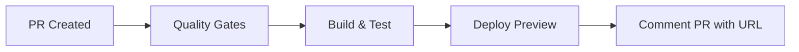
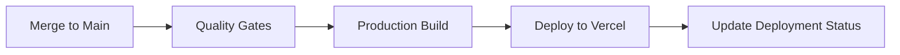

# CI/CD Pipeline Setup Guide

This repository uses GitHub Actions to automatically deploy to Vercel when code is merged to `main`. The pipeline includes comprehensive quality gates and preview deployments for pull requests.

## Pipeline Overview

### 🔄 Workflow Triggers
- **Pull Requests**: Creates preview deployments with quality checks
- **Main Branch Push**: Deploys to production after passing all quality gates

### ✅ Quality Gates
All deployments must pass these checks:
1. **TypeScript Compilation** - Ensures type safety
2. **ESLint** - Code quality and consistency
3. **Prettier** - Code formatting standards
4. **Build Verification** - Successful production build
5. **Test Suite** - All tests pass with coverage

### 🚀 Deployment Strategy
- **Preview Deployments**: Every PR gets a unique preview URL
- **Production Deployments**: Only `main` branch merges deploy to production
- **Environment Protection**: Production deployments require approval

## Setup Instructions

### 1. Vercel Project Setup

First, create and configure your Vercel project:

```bash
# Install Vercel CLI
npm i -g vercel

# Login to Vercel
vercel login

# Link your project
vercel

# Get your project details
vercel project ls
```

### 2. Required GitHub Secrets

Add these secrets to your GitHub repository (`Settings > Secrets and variables > Actions`):

#### Vercel Configuration
```bash
VERCEL_TOKEN=<your-vercel-token>
VERCEL_ORG_ID=<your-org-id>
VERCEL_PROJECT_ID=<your-project-id>
```

#### How to get these values:

**VERCEL_TOKEN:**
1. Go to [Vercel Account Settings](https://vercel.com/account/tokens)
2. Create a new token with appropriate scopes
3. Copy the token value

**VERCEL_ORG_ID & VERCEL_PROJECT_ID:**
```bash
# Run this in your project directory after vercel link
cat .vercel/project.json
```

### 3. Environment Variables

Configure environment variables in Vercel dashboard:

1. Go to your Vercel project dashboard
2. Navigate to `Settings > Environment Variables`
3. Add production/preview environment variables as needed

### 4. Branch Protection Rules

Set up branch protection for `main`:

1. Go to `Settings > Branches`
2. Add rule for `main` branch
3. Enable:
   - ✅ Require a pull request before merging
   - ✅ Require status checks to pass before merging
   - ✅ Require branches to be up to date before merging
   - ✅ Include administrators

## Workflow Details

### Preview Deployments (Pull Requests)



**Features:**
- Automatic preview URL generation
- PR comments with deployment status
- Quality gate results
- Isolated environment for testing

### Production Deployments (Main Branch)



**Features:**
- Production environment protection
- Deployment status tracking
- Automatic domain assignment
- Performance optimizations

## Package.json Scripts

Ensure your `package.json` includes these scripts:

```json
{
  "scripts": {
    "dev": "next dev",
    "build": "next build",
    "start": "next start",
    "lint": "next lint",
    "lint:fix": "next lint --fix",
    "type-check": "tsc --noEmit",
    "test": "jest",
    "test:watch": "jest --watch",
    "test:coverage": "jest --coverage",
    "prettier": "prettier --write .",
    "prettier:check": "prettier --check ."
  }
}
```

## Environment-Specific Configuration

### Development
```bash
NODE_ENV=development
NEXT_PUBLIC_APP_ENV=development
```

### Preview (PR Deployments)
```bash
NODE_ENV=production
NEXT_PUBLIC_APP_ENV=preview
```

### Production
```bash
NODE_ENV=production
NEXT_PUBLIC_APP_ENV=production
```

## Troubleshooting

### Common Issues

**1. Vercel Token Expired**
```
Error: Invalid token
```
Solution: Generate a new token in Vercel dashboard

**2. Build Failures**
```
Error: Build failed
```
Solution: Check the Actions logs and fix the reported issues

**3. Missing Environment Variables**
```
Error: Missing required environment variable
```
Solution: Add the variable in Vercel dashboard settings

### Debug Commands

```bash
# Check Vercel project status
vercel ls

# Test local build
yarn build

# Check environment variables
vercel env ls

# View deployment logs
vercel logs [deployment-url]
```

## Security Best Practices

### Secrets Management
- ✅ Never commit secrets to repository
- ✅ Use GitHub Secrets for sensitive data
- ✅ Rotate tokens regularly
- ✅ Use least-privilege access

### Environment Separation
- ✅ Different configurations per environment
- ✅ Isolated databases/services for preview vs production
- ✅ Environment-specific feature flags

## Monitoring & Alerts

### Vercel Integration
- Real-time deployment status
- Performance monitoring
- Error tracking
- Analytics dashboard

### GitHub Integration
- Deployment status checks
- PR comments with preview URLs
- Commit status updates
- Branch protection enforcement

## Support

For issues with the CI/CD pipeline:

1. Check the [Actions tab](../../actions) for detailed logs
2. Verify all required secrets are configured
3. Ensure branch protection rules are properly set
4. Check Vercel dashboard for deployment status

---

*This CI/CD setup follows industry best practices for modern web application deployment with automated quality assurance and environment isolation.*
