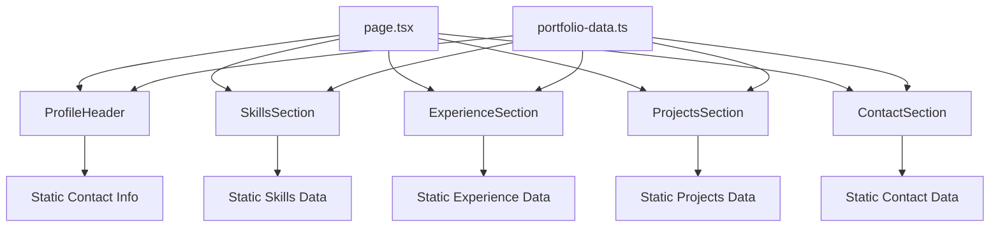

# User Story: 1 - View Professional Portfolio

**As a** potential employer or client,
**I want** to view a comprehensive digital portfolio showcasing Kent's professional information,
**so that** I can quickly assess his skills, experience, and suitability for my project or role.

## Acceptance Criteria

* Portfolio displays personal introduction and professional summary
* Skills section clearly lists technical competencies (Angular, React, Flutter, etc.)
* Work experience section shows chronological employment history with key achievements
* Projects section showcases relevant work examples
* Contact information is easily accessible
* All content is presented in a clean, professional layout

## Notes

* This story represents the core value proposition of the portfolio website
* Should serve as a live resume replacement
* Content should be based on the detailed personal information provided

## Implementation Plan

### 1. Feature Overview

This feature establishes the foundational portfolio structure, displaying Kent's professional information in a clean, comprehensive layout. The primary user role is potential employers or clients seeking to evaluate technical expertise and professional background.

### 2. Component Analysis & Reuse Strategy

**Existing Components:**
- `src/app/_components/post.tsx` - Can be analyzed as reference for component structure but will not be reused for portfolio content

**Component Strategy:**
- **New Components Required:** All portfolio components need to be created from scratch as this is the core portfolio functionality
- **Justification:** The existing post component is specific to the T3 starter template and doesn't align with portfolio requirements

**Component Library Gaps:**
- Professional header/hero section component
- Skills grid/list component
- Work experience timeline component
- Projects showcase component
- Contact information component

### 3. Affected Files

- `[CREATE] src/types/portfolio.ts`
- `[CREATE] src/data/portfolio-data.ts`
- `[CREATE] src/app/_components/portfolio/ProfileHeader.tsx`
- `[CREATE] src/app/_components/portfolio/ProfileHeader.test.tsx`
- `[CREATE] src/app/_components/portfolio/ProfileHeader.visual.spec.ts`
- `[CREATE] src/app/_components/portfolio/SkillsSection.tsx`
- `[CREATE] src/app/_components/portfolio/SkillsSection.test.tsx`
- `[CREATE] src/app/_components/portfolio/SkillsSection.visual.spec.ts`
- `[CREATE] src/app/_components/portfolio/ExperienceSection.tsx`
- `[CREATE] src/app/_components/portfolio/ExperienceSection.test.tsx`
- `[CREATE] src/app/_components/portfolio/ExperienceSection.visual.spec.ts`
- `[CREATE] src/app/_components/portfolio/ProjectsSection.tsx`
- `[CREATE] src/app/_components/portfolio/ProjectsSection.test.tsx`
- `[CREATE] src/app/_components/portfolio/ProjectsSection.visual.spec.ts`
- `[CREATE] src/app/_components/portfolio/ContactSection.tsx`
- `[CREATE] src/app/_components/portfolio/ContactSection.test.tsx`
- `[CREATE] src/app/_components/portfolio/ContactSection.visual.spec.ts`
- `[MODIFY] src/app/page.tsx`
- `[MODIFY] src/app/layout.tsx`

### 4. Component Breakdown

**ProfileHeader Component:**
- **Location:** `src/app/_components/portfolio/ProfileHeader.tsx`
- **Type:** Server Component (static content)
- **Responsibility:** Display personal introduction, professional summary, and key contact information
- **Props Interface:**
  ```typescript
  interface ProfileHeaderProps {
    name: string;
    title: string;
    summary: string;
    contact: ContactInfo;
  }
  ```

**SkillsSection Component:**
- **Location:** `src/app/_components/portfolio/SkillsSection.tsx`
- **Type:** Server Component (static content)
- **Responsibility:** Display technical competencies in organized categories
- **Props Interface:**
  ```typescript
  interface SkillsSectionProps {
    skills: SkillCategory[];
  }
  ```

**ExperienceSection Component:**
- **Location:** `src/app/_components/portfolio/ExperienceSection.tsx`
- **Type:** Server Component (static content)
- **Responsibility:** Display chronological work history with achievements
- **Props Interface:**
  ```typescript
  interface ExperienceSectionProps {
    experiences: WorkExperience[];
  }
  ```

**ProjectsSection Component:**
- **Location:** `src/app/_components/portfolio/ProjectsSection.tsx`
- **Type:** Server Component (static content initially)
- **Responsibility:** Showcase relevant work examples and projects
- **Props Interface:**
  ```typescript
  interface ProjectsSectionProps {
    projects: Project[];
  }
  ```

**ContactSection Component:**
- **Location:** `src/app/_components/portfolio/ContactSection.tsx`
- **Type:** Server Component (static content)
- **Responsibility:** Display contact information and social links
- **Props Interface:**
  ```typescript
  interface ContactSectionProps {
    contact: ContactInfo;
    socialLinks: SocialLink[];
  }
  ```

### 5. Design Specifications

**Color Analysis:**

| Design Color | Semantic Purpose | Element | Implementation Method |
|--------------|-----------------|---------|------------------------|
| #1a1a2e | Primary dark background | Main page background | Direct hex value (#1a1a2e) |
| #16213e | Secondary dark | Section backgrounds | Direct hex value (#16213e) |
| #e94560 | Accent/highlight | Call-to-action elements, links | Direct hex value (#e94560) |
| #f8f9fa | Primary text | Main text content | Direct hex value (#f8f9fa) |
| #a8a8a8 | Secondary text | Subtitle, meta text | Direct hex value (#a8a8a8) |
| #4d4d4d | Border/separator | Section dividers, card borders | Direct hex value (#4d4d4d) |
| #2ecc71 | Success/positive | Skill indicators, achievements | Direct hex value (#2ecc71) |
| #3498db | Information | Links, interactive elements | Direct hex value (#3498db) |

**Spacing Grid System:**
- Base unit: 8px
- Small: 8px, 16px
- Medium: 24px, 32px
- Large: 48px, 64px
- Extra large: 96px, 128px

**Typography Hierarchy:**
- H1 (Hero): 4rem (64px), font-weight: 700
- H2 (Section): 2.5rem (40px), font-weight: 600
- H3 (Subsection): 1.5rem (24px), font-weight: 600
- Body: 1rem (16px), font-weight: 400
- Small: 0.875rem (14px), font-weight: 400

**Visual Hierarchy Diagram:**
```
Portfolio Page
├── ProfileHeader (Hero Section)
│   ├── Name & Title
│   ├── Professional Summary
│   └── Primary Contact
├── SkillsSection
│   ├── Technical Skills Grid
│   └── Skill Categories
├── ExperienceSection
│   ├── Timeline Layout
│   └── Experience Cards
├── ProjectsSection
│   ├── Project Grid
│   └── Project Cards
└── ContactSection
    ├── Contact Information
    └── Social Links
```

**Responsive Breakpoints:**
- Mobile: 375px - 767px
- Tablet: 768px - 1023px
- Desktop: 1024px - 1439px
- Large: 1440px+

### 6. Data Flow & State Management

**TypeScript Types Location:** `src/types/portfolio.ts`

**Type Definitions:**
```typescript
interface ContactInfo {
  phone: string;
  email?: string;
  location: string;
  residence: string;
}

interface SkillCategory {
  category: string;
  skills: string[];
}

interface WorkExperience {
  id: string;
  position: string;
  company: string;
  location: string;
  startDate: string;
  endDate: string;
  description: string;
  achievements: string[];
}

interface Project {
  id: string;
  title: string;
  description: string;
  technologies: string[];
  highlights: string[];
}

interface SocialLink {
  platform: string;
  url: string;
  icon: string;
}
```

**Data Strategy:**
- **Server Components:** All components will fetch data from static data files (`src/data/portfolio-data.ts`)
- **No API calls required:** Content is static and based on provided personal information
- **State Management:** No complex state management needed - all content is static

### 7. API Endpoints & Contracts

No API endpoints required for this feature. All data will be statically defined in `src/data/portfolio-data.ts` based on the provided personal information.

### 8. Integration Diagram



### 9. Styling

**Design System Implementation:**
- **Background:** #1a1a2e (primary dark) for main page, #16213e for section cards
- **Text Colors:** #f8f9fa for primary text, #a8a8a8 for secondary text
- **Accent Colors:** #e94560 for highlights, #3498db for links, #2ecc71 for positive indicators
- **Typography:** Geist font family, following established hierarchy
- **Spacing:** 8px base grid system with consistent padding and margins
- **Cards:** Subtle borders (#4d4d4d), rounded corners (8px), subtle shadows

**Component Styling Patterns:**
- Section containers: Full width with max-width constraints and centered alignment
- Cards: Consistent padding (24px), border radius (8px), subtle background variations
- Grid layouts: CSS Grid for skills, flexbox for experience timeline
- Responsive images: Aspect ratio preservation, lazy loading

**Visual Implementation Checklist:**
- [ ] Verify color contrast ratios meet WCAG AA standards
- [ ] Implement consistent spacing using 8px grid system
- [ ] Apply responsive typography scaling
- [ ] Ensure card shadows and borders are consistent
- [ ] Test responsive breakpoints for all components

### 10. Testing Strategy

**Unit Tests:**
- `src/app/_components/portfolio/ProfileHeader.test.tsx` - Props rendering, contact info display
- `src/app/_components/portfolio/SkillsSection.test.tsx` - Skills categorization, grid layout
- `src/app/_components/portfolio/ExperienceSection.test.tsx` - Experience timeline, date formatting
- `src/app/_components/portfolio/ProjectsSection.test.tsx` - Project card rendering, technology lists
- `src/app/_components/portfolio/ContactSection.test.tsx` - Contact information, social links

**Component Tests:**
- Test data prop handling and rendering
- Verify responsive behavior at different breakpoints
- Test accessibility features (ARIA labels, semantic HTML)

**Visual Tests:**
- `src/app/_components/portfolio/ProfileHeader.visual.spec.ts`
- `src/app/_components/portfolio/SkillsSection.visual.spec.ts`
- `src/app/_components/portfolio/ExperienceSection.visual.spec.ts`
- `src/app/_components/portfolio/ProjectsSection.visual.spec.ts`
- `src/app/_components/portfolio/ContactSection.visual.spec.ts`

### 11. Accessibility (A11y) Considerations

- **Semantic HTML:** Use proper heading hierarchy (h1, h2, h3)
- **ARIA Labels:** Add descriptive labels for skills, experience timeline
- **Keyboard Navigation:** Ensure all interactive elements are keyboard accessible
- **Screen Reader Support:** Provide alt text for any icons or images
- **Color Contrast:** Maintain WCAG AA contrast ratios for all text elements
- **Focus Management:** Clear focus indicators for interactive elements

### 12. Security Considerations

- **Static Content:** No user input or dynamic content reduces security risks
- **Contact Information:** Consider obfuscating email address to prevent spam
- **External Links:** Ensure social links use appropriate rel attributes
- **Content Sanitization:** Validate and sanitize any dynamic content in future iterations

### 13. Implementation Steps

**Implementation Checklist:**

**Phase 1: UI Implementation with Mock Data**

**1. Setup & Types:**
- [ ] Define portfolio types in `src/types/portfolio.ts`
- [ ] Create portfolio data structure in `src/data/portfolio-data.ts` with content from personal_info.txt
- [ ] Set up mock project data for demonstration

**2. UI Components:**
- [ ] Create `src/app/_components/portfolio/ProfileHeader.tsx`
- [ ] Implement name, title, summary display with responsive design
- [ ] Create `src/app/_components/portfolio/SkillsSection.tsx`
- [ ] Implement skills grid with category organization
- [ ] Create `src/app/_components/portfolio/ExperienceSection.tsx`
- [ ] Implement timeline layout with experience cards
- [ ] Create `src/app/_components/portfolio/ProjectsSection.tsx`
- [ ] Implement project grid with technology highlights
- [ ] Create `src/app/_components/portfolio/ContactSection.tsx`
- [ ] Implement contact information with social links

**3. Styling:**
- [ ] Verify all colors match design system EXACTLY using direct hex values (#1a1a2e, #16213e, #e94560, #f8f9fa, #a8a8a8, #4d4d4d, #2ecc71, #3498db)
- [ ] Verify spacing follows 8px grid system EXACTLY (8px, 16px, 24px, 32px, 48px, 64px, 96px, 128px)
- [ ] Verify typography matches hierarchy EXACTLY (4rem/700, 2.5rem/600, 1.5rem/600, 1rem/400, 0.875rem/400)
- [ ] Apply responsive breakpoints (375px, 768px, 1024px, 1440px)
- [ ] Implement card styling with consistent borders and shadows
- [ ] Test color contrast ratios for accessibility compliance

**4. UI Testing:**
- [ ] Write component tests for all portfolio components with mock data
- [ ] Create Playwright visual tests for each component
- [ ] Configure tests for all viewport sizes (375x667px, 768x1024px, 1280x800px, 1920x1080px)
- [ ] Add visual color verification tests with exact RGB values using CSS property assertions
- [ ] Add spacing/layout verification tests with pixel measurements using DOM properties
- [ ] Add typography verification tests for font sizes and weights using computed styles
- [ ] Add comprehensive data-testid attributes to all component elements
- [ ] Manual accessibility testing with screen readers

**5. Page Integration:**
- [ ] Update `src/app/page.tsx` to render portfolio components
- [ ] Remove T3 starter template content
- [ ] Update `src/app/layout.tsx` metadata for portfolio
- [ ] Test complete page layout and component integration

**Phase 2: Content Enhancement & Polish**

**6. Content Refinement:**
- [ ] Enhance project descriptions with specific achievements
- [ ] Add technology icons or visual indicators for skills
- [ ] Optimize content hierarchy and readability
- [ ] Add professional headshot or avatar (optional)

**7. Performance Optimization:**
- [ ] Implement lazy loading for images
- [ ] Optimize component bundle sizes
- [ ] Test page load performance
- [ ] Ensure efficient rendering with server components

**8. Final Testing & Documentation:**
- [ ] Comprehensive end-to-end testing of complete portfolio
- [ ] Cross-browser testing (Chrome, Firefox, Safari, Edge)
- [ ] Mobile device testing on various screen sizes
- [ ] Performance audit and optimization
- [ ] Add JSDoc documentation for all components

### References

- Personal information source: `docs/personal_info.txt`
- Project structure reference: T3 Stack conventions
- Design system: Custom tech-inspired theme with professional aesthetics
