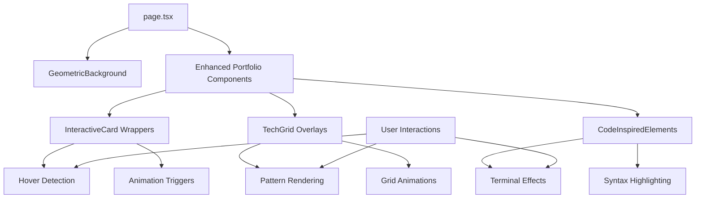

# User Story: 2 - Experience Modern Interactive Design

**As a** website visitor,
**I want** to interact with a modern, sleek interface with tech-inspired visual elements,
**so that** I have an engaging and memorable browsing experience that reflects the portfolio owner's technical sophistication.

## Acceptance Criteria

* Website features a modern, minimalist design theme
* Design incorporates tech/code-inspired elements (terminal vibes, geometric layouts, grids)
* Visual design is sleek and high-end in appearance
* Interface elements are interactive and respond to user actions
* Design enhances rather than distracts from content consumption
* Overall aesthetic reflects professional technical expertise

## Notes

* Design should appeal to tech industry professionals and clients
* Balance between visual appeal and content accessibility is crucial

## Implementation Plan

### 1. Feature Overview

This feature establishes the visual design language and interactive elements that give the portfolio a modern, tech-inspired aesthetic. The goal is to create an engaging, memorable experience that reflects technical sophistication while maintaining professional credibility.

### 2. Component Analysis & Reuse Strategy

**Existing Components:**
- All portfolio components from Feature 1 will need interactive enhancements
- Design system established in Feature 1 will be extended with interactive states

**Enhancement Strategy:**
- **Modify Existing:** All portfolio components will be enhanced with interactive behaviors
- **New Components Required:** Interactive UI primitives, hover effects, micro-interactions
- **Justification:** Building upon the foundation from Feature 1 while adding sophisticated interactions

**Component Library Additions:**
- Interactive button components with hover states
- Card components with hover and focus animations
- Tech-inspired geometric background elements
- Interactive grid overlays and terminal-style elements

### 3. Affected Files

- `[CREATE] src/app/_components/ui/InteractiveCard.tsx`
- `[CREATE] src/app/_components/ui/InteractiveCard.test.tsx`
- `[CREATE] src/app/_components/ui/InteractiveCard.visual.spec.ts`
- `[CREATE] src/app/_components/ui/TechGrid.tsx`
- `[CREATE] src/app/_components/ui/TechGrid.test.tsx`
- `[CREATE] src/app/_components/ui/TechGrid.visual.spec.ts`
- `[CREATE] src/app/_components/ui/InteractiveButton.tsx`
- `[CREATE] src/app/_components/ui/InteractiveButton.test.tsx`
- `[CREATE] src/app/_components/ui/InteractiveButton.visual.spec.ts`
- `[CREATE] src/app/_components/effects/GeometricBackground.tsx`
- `[CREATE] src/app/_components/effects/GeometricBackground.test.tsx`
- `[CREATE] src/app/_components/effects/GeometricBackground.visual.spec.ts`
- `[CREATE] src/app/_components/effects/CodeInspiredElements.tsx`
- `[CREATE] src/app/_components/effects/CodeInspiredElements.test.tsx`
- `[CREATE] src/app/_components/effects/CodeInspiredElements.visual.spec.ts`
- `[MODIFY] src/app/_components/portfolio/ProfileHeader.tsx`
- `[MODIFY] src/app/_components/portfolio/SkillsSection.tsx`
- `[MODIFY] src/app/_components/portfolio/ExperienceSection.tsx`
- `[MODIFY] src/app/_components/portfolio/ProjectsSection.tsx`
- `[MODIFY] src/app/_components/portfolio/ContactSection.tsx`
- `[MODIFY] src/app/page.tsx`
- `[CREATE] src/styles/animations.css`

### 4. Component Breakdown

**InteractiveCard Component:**
- **Location:** `src/app/_components/ui/InteractiveCard.tsx`
- **Type:** Client Component (requires interaction handling)
- **Responsibility:** Provide interactive card behavior with hover effects, subtle animations
- **Props Interface:**
  ```typescript
  interface InteractiveCardProps {
    children: React.ReactNode;
    variant?: 'default' | 'elevated' | 'tech';
    interactive?: boolean;
    className?: string;
    onHover?: () => void;
  }
  ```

**TechGrid Component:**
- **Location:** `src/app/_components/ui/TechGrid.tsx`
- **Type:** Client Component (interactive grid patterns)
- **Responsibility:** Display tech-inspired grid overlays and geometric patterns
- **Props Interface:**
  ```typescript
  interface TechGridProps {
    pattern?: 'dots' | 'lines' | 'hexagon';
    intensity?: 'subtle' | 'medium' | 'prominent';
    animated?: boolean;
  }
  ```

**InteractiveButton Component:**
- **Location:** `src/app/_components/ui/InteractiveButton.tsx`
- **Type:** Client Component (interaction states)
- **Responsibility:** Provide sophisticated button interactions with tech-inspired effects
- **Props Interface:**
  ```typescript
  interface InteractiveButtonProps {
    children: React.ReactNode;
    variant?: 'primary' | 'secondary' | 'ghost' | 'tech';
    size?: 'sm' | 'md' | 'lg';
    onClick?: () => void;
    disabled?: boolean;
  }
  ```

**GeometricBackground Component:**
- **Location:** `src/app/_components/effects/GeometricBackground.tsx`
- **Type:** Client Component (animated backgrounds)
- **Responsibility:** Render subtle geometric background patterns and shapes
- **Props Interface:**
  ```typescript
  interface GeometricBackgroundProps {
    pattern?: 'triangles' | 'hexagons' | 'circuits';
    opacity?: number;
    animated?: boolean;
  }
  ```

**CodeInspiredElements Component:**
- **Location:** `src/app/_components/effects/CodeInspiredElements.tsx`
- **Type:** Client Component (terminal-style elements)
- **Responsibility:** Display terminal-inspired UI elements, code blocks, syntax highlighting
- **Props Interface:**
  ```typescript
  interface CodeInspiredElementsProps {
    type?: 'terminal' | 'code' | 'syntax';
    content?: string;
    language?: string;
    animated?: boolean;
  }
  ```

### 5. Design Specifications

**Enhanced Color Analysis:**

| Design Color | Semantic Purpose | Element | Implementation Method |
|--------------|-----------------|---------|------------------------|
| #1a1a2e | Primary dark background | Main backgrounds, terminal dark | Direct hex value (#1a1a2e) |
| #16213e | Secondary dark | Interactive card backgrounds | Direct hex value (#16213e) |
| #e94560 | Accent/highlight | Hover states, active elements | Direct hex value (#e94560) |
| #ff6b9d | Tech accent | Interactive highlights, tech elements | Direct hex value (#ff6b9d) |
| #00f5ff | Cyber blue | Terminal text, tech grid lines | Direct hex value (#00f5ff) |
| #f8f9fa | Primary text | Main content text | Direct hex value (#f8f9fa) |
| #a8a8a8 | Secondary text | Meta information, placeholders | Direct hex value (#a8a8a8) |
| #4d4d4d | Border/separator | Grid lines, card borders | Direct hex value (#4d4d4d) |
| #2ecc71 | Success/positive | Success states, skill indicators | Direct hex value (#2ecc71) |
| #3498db | Information | Links, informational elements | Direct hex value (#3498db) |
| #9b59b6 | Tech purple | Code syntax, tech highlights | Direct hex value (#9b59b6) |

**Interactive States:**
- **Hover:** Subtle scale transform (1.02x), color shifts, shadow elevation
- **Focus:** Outline glow with primary accent color
- **Active:** Slight scale down (0.98x), color darkening
- **Loading:** Pulsing opacity animations, skeleton states

**Tech-Inspired Elements:**
- Grid patterns with CSS Grid and geometric shapes
- Terminal-style typography with monospace fonts
- Syntax highlighting color schemes
- Circuit board-inspired line patterns
- Hexagonal grid overlays

### 6. Data Flow & State Management

**Additional Types Location:** `src/types/ui.ts`

**Enhanced Type Definitions:**
```typescript
interface InteractionState {
  isHovered: boolean;
  isFocused: boolean;
  isActive: boolean;
}

interface AnimationConfig {
  duration: number;
  easing: string;
  delay?: number;
}

interface TechPattern {
  type: 'grid' | 'circuit' | 'terminal' | 'code';
  config: Record<string, any>;
  animated: boolean;
}
```

**State Management:**
- **Client Components:** Use React hooks for interaction states (hover, focus, active)
- **Animation State:** Track animation progress and interaction feedback
- **Theme State:** Manage interactive theme preferences and tech pattern visibility

### 7. API Endpoints & Contracts

No additional API endpoints required. All interactive behaviors are client-side only.

### 8. Integration Diagram



### 9. Styling

**Interactive Design System:**
- **Base Colors:** All existing colors plus tech-inspired additions (#ff6b9d, #00f5ff, #9b59b6)
- **Hover Effects:** Transform scale, color transitions, shadow elevation
- **Focus States:** Glowing outlines with accent colors
- **Animation Timing:** 200ms for micro-interactions, 400ms for state changes
- **Easing Functions:** Custom cubic-bezier for tech-inspired motion

**Tech Pattern Implementation:**
- **Grid Overlays:** CSS Grid with geometric patterns
- **Circuit Lines:** SVG paths with animated dash patterns
- **Terminal Elements:** Monospace typography with cursor animations
- **Code Blocks:** Syntax highlighting with tech color palette

**Animation Guidelines:**
- Subtle entrance animations (fade-in, slide-up)
- Hover micro-animations (scale, glow, color shift)
- Loading states with tech-inspired patterns
- Smooth transitions between interactive states

### 10. Testing Strategy

**Enhanced Unit Tests:**
- `src/app/_components/ui/InteractiveCard.test.tsx` - Interaction state handling, hover effects
- `src/app/_components/ui/TechGrid.test.tsx` - Pattern rendering, animation control
- `src/app/_components/ui/InteractiveButton.test.tsx` - Button states, click handling
- `src/app/_components/effects/GeometricBackground.test.tsx` - Background rendering, performance
- `src/app/_components/effects/CodeInspiredElements.test.tsx` - Terminal elements, syntax highlighting

**Interaction Tests:**
- Mouse hover and focus behavior testing
- Keyboard navigation and accessibility
- Touch interaction testing for mobile devices
- Animation performance and timing verification

**Visual Tests:**
- Color accuracy for all interactive states
- Animation smoothness and timing verification
- Pattern rendering across different viewports
- Interactive state visual feedback validation

### 11. Accessibility (A11y) Considerations

- **Interactive Elements:** Clear focus indicators with sufficient contrast
- **Animation Preferences:** Respect `prefers-reduced-motion` for accessibility
- **Keyboard Navigation:** Full keyboard support for all interactive elements
- **Screen Readers:** Proper ARIA labels for interactive states and animations
- **Color Accessibility:** Maintain contrast ratios for all interactive states
- **Motion Sensitivity:** Provide options to disable animations

### 12. Security Considerations

- **Client-Side Only:** All interactions are purely client-side, reducing security concerns
- **Performance Impact:** Monitor animation performance to prevent DoS on slower devices
- **Content Security:** Ensure any dynamic pattern generation doesn't introduce XSS risks

### 13. Implementation Steps

**Implementation Checklist:**

**Phase 1: UI Implementation with Mock Data**

**1. Enhanced Design System:**
- [ ] Create `src/styles/animations.css` with tech-inspired animation utilities
- [ ] Define animation timing and easing functions
- [ ] Set up CSS custom properties for interactive states
- [ ] Add tech color palette extensions (#ff6b9d, #00f5ff, #9b59b6)

**2. Interactive UI Components:**
- [ ] Create `src/app/_components/ui/InteractiveCard.tsx`
- [ ] Implement hover, focus, and active state handling
- [ ] Add smooth transitions and micro-animations
- [ ] Create `src/app/_components/ui/TechGrid.tsx`
- [ ] Implement geometric grid patterns with CSS Grid
- [ ] Add animated grid overlays and circuit patterns
- [ ] Create `src/app/_components/ui/InteractiveButton.tsx`
- [ ] Implement sophisticated button interactions
- [ ] Add tech-inspired button variants

**3. Tech-Inspired Effects:**
- [ ] Create `src/app/_components/effects/GeometricBackground.tsx`
- [ ] Implement subtle background geometric patterns
- [ ] Add animated background elements with performance optimization
- [ ] Create `src/app/_components/effects/CodeInspiredElements.tsx`
- [ ] Implement terminal-style UI elements
- [ ] Add syntax highlighting and code block styling
- [ ] Create animated cursor and typing effects

**4. Enhanced Portfolio Components:**
- [ ] Modify `ProfileHeader.tsx` to use InteractiveCard wrapper
- [ ] Add hover effects and tech grid overlays
- [ ] Modify `SkillsSection.tsx` with interactive skill cards
- [ ] Add skill hover states and tech pattern backgrounds
- [ ] Modify `ExperienceSection.tsx` with interactive timeline
- [ ] Add hover effects for experience cards
- [ ] Modify `ProjectsSection.tsx` with enhanced project cards
- [ ] Add project image hover effects and tech highlights
- [ ] Modify `ContactSection.tsx` with interactive contact elements
- [ ] Add tech-inspired contact link styling

**5. Styling Implementation:**
- [ ] Verify all colors match enhanced design system EXACTLY using direct hex values
- [ ] Verify interactive states use correct color transitions
- [ ] Verify animation timing follows tech-inspired guidelines (200ms micro, 400ms state)
- [ ] Apply hover effects with proper transform and shadow values
- [ ] Implement focus states with glowing outlines
- [ ] Test animation performance across devices
- [ ] Ensure responsive behavior for all interactive elements

**6. UI Testing:**
- [ ] Write interaction tests for all enhanced components
- [ ] Create Playwright visual tests for interactive states
- [ ] Test hover effects across all viewport sizes
- [ ] Add interaction verification tests with mouse and keyboard
- [ ] Add animation timing verification tests
- [ ] Test accessibility features for interactive elements
- [ ] Add comprehensive data-testid attributes for interactive states
- [ ] Manual testing of animation performance

**Phase 2: Animation & Performance Optimization**

**7. Animation Refinement:**
- [ ] Optimize animation performance for 60fps target
- [ ] Implement proper animation cleanup and memory management
- [ ] Add animation preference detection (prefers-reduced-motion)
- [ ] Fine-tune easing functions for tech-inspired motion

**8. Interactive Enhancement:**
- [ ] Add subtle sound effects for interactions (optional)
- [ ] Implement advanced hover states with depth perception
- [ ] Add gesture support for touch devices
- [ ] Optimize interaction feedback timing

**9. Cross-Device Testing:**
- [ ] Test interactive behaviors on desktop (mouse)
- [ ] Test touch interactions on tablets and phones
- [ ] Verify animation performance on slower devices
- [ ] Test keyboard navigation with interactive elements

**10. Final Polish:**
- [ ] Performance audit of animations and interactions
- [ ] Accessibility audit of interactive states
- [ ] Cross-browser testing of advanced CSS features
- [ ] Documentation of interaction patterns and guidelines

### Playwright E2E & Visual Testing (for Interactive Elements)

**Visual Testing Strategy:**
- **Interactive State Testing:** Test default, hover, focus, and active states for all interactive elements
- **Animation Verification:** Validate animation timing, easing, and visual feedback
- **Pattern Rendering:** Verify geometric backgrounds, grid patterns, and tech elements render correctly
- **Cross-viewport Testing:** Test interactive behaviors across Mobile (375x667px), Tablet (768x1024px), Desktop (1280x800px), Large (1920x1080px)

**Required Test Files:**
- `src/app/_components/ui/InteractiveCard.visual.spec.ts`
- `src/app/_components/ui/TechGrid.visual.spec.ts`
- `src/app/_components/ui/InteractiveButton.visual.spec.ts`
- `src/app/_components/effects/GeometricBackground.visual.spec.ts`
- `src/app/_components/effects/CodeInspiredElements.visual.spec.ts`

**Visual Test Requirements:**
- Validate exact colors for all interactive states using RGB values
- Test animation timing and smooth transitions
- Verify hover effect visual feedback
- Check pattern rendering accuracy and performance
- Test accessibility features (focus indicators, contrast ratios)

### References

- Design inspiration: Modern tech portfolios, terminal interfaces, geometric patterns
- Animation guidelines: Web animation best practices, 60fps performance targets
- Accessibility standards: WCAG 2.1 AA for interactive elements
- Tech aesthetics: Code syntax highlighting, terminal themes, circuit board designs
