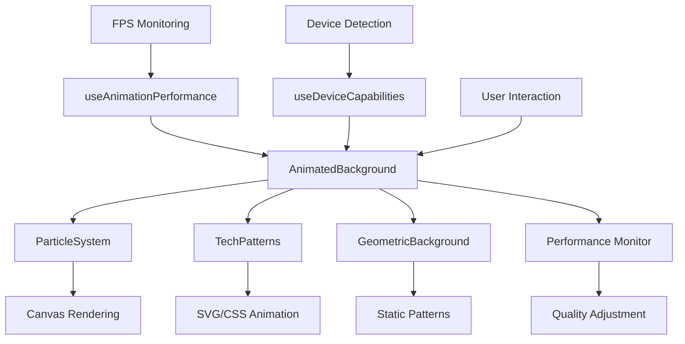

# User Story: 3 - Enjoy Animated Background Experience

**As a** website visitor,
**I want** to see subtle, tech-inspired animated background elements,
**so that** the website feels dynamic and visually engaging without being distracting.

## Acceptance Criteria

* Animated background is minimalistic and tech-inspired
* Animations enhance visual appeal without interfering with content readability
* Background elements are performance-optimized and don't slow down the site
* Animations are subtle enough to maintain professional appearance
* Background complements the overall modern design theme

## Notes

* Animation should be lightweight to ensure good performance across devices
* Should align with the tech/code aesthetic mentioned in requirements

## Implementation Plan

### 1. Feature Overview

This feature creates a dynamic, animated background system that enhances the visual appeal of the portfolio while maintaining performance and readability. The animations are tech-inspired, subtle, and optimized for all devices.

### 2. Component Analysis & Reuse Strategy

**Existing Components:**
- `GeometricBackground` from Feature 2 will serve as the foundation
- Background system will integrate with existing layout components

**Enhancement Strategy:**
- **Extend Existing:** Build upon GeometricBackground component with advanced animations
- **New Components Required:** Particle systems, animated patterns, performance monitoring
- **Justification:** Leverages existing geometric foundation while adding sophisticated animation layers

**Component Library Additions:**
- Particle animation system
- Canvas-based background effects
- Performance-optimized animation loops
- Device-adaptive animation controls

### 3. Affected Files

- `[CREATE] src/app/_components/backgrounds/AnimatedBackground.tsx`
- `[CREATE] src/app/_components/backgrounds/AnimatedBackground.test.tsx`
- `[CREATE] src/app/_components/backgrounds/AnimatedBackground.visual.spec.ts`
- `[CREATE] src/app/_components/backgrounds/ParticleSystem.tsx`
- `[CREATE] src/app/_components/backgrounds/ParticleSystem.test.tsx`
- `[CREATE] src/app/_components/backgrounds/ParticleSystem.visual.spec.ts`
- `[CREATE] src/app/_components/backgrounds/TechPatterns.tsx`
- `[CREATE] src/app/_components/backgrounds/TechPatterns.test.tsx`
- `[CREATE] src/app/_components/backgrounds/TechPatterns.visual.spec.ts`
- `[CREATE] src/hooks/useAnimationPerformance.ts`
- `[CREATE] src/hooks/useDeviceCapabilities.ts`
- `[CREATE] src/utils/animationHelpers.ts`
- `[MODIFY] src/app/_components/effects/GeometricBackground.tsx`
- `[MODIFY] src/app/page.tsx`
- `[MODIFY] src/app/layout.tsx`
- `[CREATE] src/styles/backgrounds.css`

### 4. Component Breakdown

**AnimatedBackground Component:**
- **Location:** `src/app/_components/backgrounds/AnimatedBackground.tsx`
- **Type:** Client Component (requires animation controls)
- **Responsibility:** Orchestrate multiple background animation layers with performance monitoring
- **Props Interface:**
  ```typescript
  interface AnimatedBackgroundProps {
    intensity?: 'minimal' | 'moderate' | 'full';
    pattern?: 'particles' | 'geometric' | 'tech' | 'mixed';
    pauseOnLowPerformance?: boolean;
    reduceMotion?: boolean;
    className?: string;
  }
  ```

**ParticleSystem Component:**
- **Location:** `src/app/_components/backgrounds/ParticleSystem.tsx`
- **Type:** Client Component (canvas-based animations)
- **Responsibility:** Render and animate particle effects with performance optimization
- **Props Interface:**
  ```typescript
  interface ParticleSystemProps {
    particleCount?: number;
    particleSize?: number;
    speed?: number;
    color?: string;
    opacity?: number;
    interactive?: boolean;
  }
  ```

**TechPatterns Component:**
- **Location:** `src/app/_components/backgrounds/TechPatterns.tsx`
- **Type:** Client Component (SVG/CSS animations)
- **Responsibility:** Render tech-inspired patterns with smooth animations
- **Props Interface:**
  ```typescript
  interface TechPatternsProps {
    pattern?: 'grid' | 'circuit' | 'binary' | 'network';
    animationSpeed?: 'slow' | 'medium' | 'fast';
    density?: 'sparse' | 'normal' | 'dense';
    color?: string;
  }
  ```

**useAnimationPerformance Hook:**
- **Location:** `src/hooks/useAnimationPerformance.ts`
- **Responsibility:** Monitor animation performance and adjust quality dynamically
- **Return Interface:**
  ```typescript
  interface AnimationPerformance {
    fps: number;
    isLowPerformance: boolean;
    shouldReduceAnimations: boolean;
    adjustQuality: (quality: 'low' | 'medium' | 'high') => void;
  }
  ```

**useDeviceCapabilities Hook:**
- **Location:** `src/hooks/useDeviceCapabilities.ts`
- **Responsibility:** Detect device capabilities and recommend animation settings
- **Return Interface:**
  ```typescript
  interface DeviceCapabilities {
    isMobile: boolean;
    isLowPower: boolean;
    supportsWebGL: boolean;
    preferredQuality: 'low' | 'medium' | 'high';
    maxParticles: number;
  }
  ```

### 5. Design Specifications

**Animation Color Palette:**

| Design Color | Semantic Purpose | Element | Implementation Method |
|--------------|-----------------|---------|------------------------|
| #1a1a2e | Base background | Primary canvas background | Direct hex value (#1a1a2e) |
| #16213e | Secondary layer | Pattern background overlays | Direct hex value (#16213e) |
| #00f5ff | Tech cyan | Particle primary color | Direct hex value (#00f5ff) |
| #ff6b9d | Tech magenta | Particle secondary color | Direct hex value (#ff6b9d) |
| #9b59b6 | Tech purple | Circuit line color | Direct hex value (#9b59b6) |
| #2ecc71 | Tech green | Success state particles | Direct hex value (#2ecc71) |
| #3498db | Tech blue | Information particles | Direct hex value (#3498db) |
| #4d4d4d | Subtle gray | Grid lines, subtle patterns | Direct hex value (#4d4d4d) |

**Animation Specifications:**
- **Particle Movement:** Slow, organic floating motion (2-5px/second)
- **Pattern Transitions:** Smooth morphing between states (3-5 second cycles)
- **Opacity Ranges:** 0.1-0.3 for subtlety, 0.4-0.6 for emphasis
- **Size Variations:** 1-4px particles, 10-50px pattern elements
- **Animation Timing:** 60fps target, graceful degradation to 30fps

**Tech Pattern Types:**
1. **Grid Patterns:** Animated dot matrix with connection lines
2. **Circuit Patterns:** Flowing energy through circuit-like paths
3. **Binary Patterns:** Scrolling binary code with fade effects
4. **Network Patterns:** Connected nodes with pulsing connections

### 6. Data Flow & State Management

**Additional Types Location:** `src/types/animations.ts`

**Animation Type Definitions:**
```typescript
interface ParticleConfig {
  count: number;
  size: number;
  speed: number;
  color: string;
  opacity: number;
  movement: 'float' | 'linear' | 'orbital';
}

interface PatternConfig {
  type: 'grid' | 'circuit' | 'binary' | 'network';
  density: number;
  animationSpeed: number;
  color: string;
  opacity: number;
}

interface PerformanceMetrics {
  fps: number;
  memoryUsage: number;
  cpuUsage: number;
  timestamp: number;
}
```

**State Management:**
- **Animation State:** Track active animations, performance metrics, quality settings
- **Device Adaptation:** Dynamically adjust animation complexity based on device capabilities
- **User Preferences:** Respect `prefers-reduced-motion` and performance preferences

### 7. API Endpoints & Contracts

No API endpoints required. All animations are client-side with local performance monitoring.

### 8. Integration Diagram



### 9. Styling

**Background Animation System:**
- **Layering:** Multiple z-index layers (-1 to -5) for depth perception
- **Blending:** CSS mix-blend-mode for subtle color interactions
- **Performance:** GPU-accelerated transforms and opacity changes
- **Responsiveness:** Adaptive animation complexity based on viewport size

**Animation Performance Guidelines:**
- **GPU Acceleration:** Use transform3d and will-change properties
- **Memory Management:** Cleanup animation frames and event listeners
- **Quality Scaling:** Reduce particle count and animation frequency on slower devices
- **Battery Conservation:** Pause animations when page is not visible

**CSS Animation Properties:**
```css
/* Smooth hardware-accelerated animations */
.animated-background {
  transform: translate3d(0, 0, 0);
  will-change: transform, opacity;
  backface-visibility: hidden;
}

/* Performance-optimized particles */
.particle {
  animation-fill-mode: both;
  animation-timing-function: linear;
  contain: layout style paint;
}
```

### 10. Testing Strategy

**Performance Tests:**
- `src/app/_components/backgrounds/AnimatedBackground.test.tsx` - Performance monitoring, quality adjustment
- `src/app/_components/backgrounds/ParticleSystem.test.tsx` - Particle rendering, canvas performance
- `src/app/_components/backgrounds/TechPatterns.test.tsx` - Pattern animations, SVG optimization

**Animation Tests:**
- Frame rate monitoring and performance benchmarks
- Memory usage tracking during long animation cycles
- Device capability detection accuracy
- Animation quality scaling verification

**Visual Tests:**
- Animation smoothness across different devices
- Color accuracy for animated elements
- Pattern rendering consistency
- Performance degradation handling

### 11. Accessibility (A11y) Considerations

- **Motion Sensitivity:** Full support for `prefers-reduced-motion` media query
- **Cognitive Load:** Ensure animations don't interfere with content comprehension
- **Focus Management:** Background animations don't affect keyboard navigation
- **Screen Readers:** Animations are purely decorative and don't convey information
- **Seizure Prevention:** Avoid rapid flashing or high-contrast oscillations
- **Battery Conservation:** Respect power-saving modes and low-battery states

### 12. Security Considerations

- **Canvas Security:** Ensure canvas rendering doesn't expose sensitive information
- **Performance DoS:** Prevent malicious overloading of animation systems
- **Memory Management:** Proper cleanup to prevent memory leaks
- **Third-party Libraries:** Vet any animation libraries for security vulnerabilities

### 13. Implementation Steps

**Implementation Checklist:**

**Phase 1: UI Implementation with Mock Data**

**1. Foundation Setup:**
- [ ] Create `src/styles/backgrounds.css` with animation utilities
- [ ] Define GPU-accelerated animation properties
- [ ] Set up CSS custom properties for dynamic animation control
- [ ] Create animation performance monitoring utilities

**2. Core Animation Components:**
- [ ] Create `src/app/_components/backgrounds/AnimatedBackground.tsx`
- [ ] Implement animation orchestration and layer management
- [ ] Add performance monitoring integration
- [ ] Create `src/app/_components/backgrounds/ParticleSystem.tsx`
- [ ] Implement canvas-based particle rendering
- [ ] Add particle physics and movement systems
- [ ] Create `src/app/_components/backgrounds/TechPatterns.tsx`
- [ ] Implement SVG-based tech pattern animations
- [ ] Add pattern morphing and transition effects

**3. Performance Optimization Hooks:**
- [ ] Create `src/hooks/useAnimationPerformance.ts`
- [ ] Implement FPS monitoring and performance metrics
- [ ] Add automatic quality adjustment logic
- [ ] Create `src/hooks/useDeviceCapabilities.ts`
- [ ] Implement device capability detection
- [ ] Add adaptive animation configuration

**4. Animation Integration:**
- [ ] Modify `GeometricBackground.tsx` to work with new animation system
- [ ] Integrate AnimatedBackground into page layout
- [ ] Set up animation layers with proper z-indexing
- [ ] Configure animation timing and coordination

**5. Styling Implementation:**
- [ ] Verify animation colors match design system EXACTLY using direct hex values
- [ ] Apply GPU-accelerated properties for smooth performance
- [ ] Implement responsive animation scaling
- [ ] Set up proper layering and z-index management
- [ ] Add CSS containment for performance optimization
- [ ] Test animation performance across devices

**6. Performance Testing:**
- [ ] Create performance benchmark tests
- [ ] Test animation frame rates on various devices
- [ ] Verify memory usage stays within acceptable limits
- [ ] Test graceful degradation on low-performance devices
- [ ] Add comprehensive performance monitoring data-testid attributes

**Phase 2: Animation Enhancement & Optimization**

**7. Advanced Animation Features:**
- [ ] Implement interactive particle systems (mouse followers)
- [ ] Add seasonal or time-based animation variations
- [ ] Create animation presets for different performance levels
- [ ] Add animation customization options

**8. Performance Optimization:**
- [ ] Implement Web Workers for heavy animation calculations
- [ ] Add intelligent animation pausing based on visibility
- [ ] Optimize animation loops and cleanup procedures
- [ ] Implement battery-aware animation scaling

**9. Cross-Device Testing:**
- [ ] Test animations on high-refresh rate displays (120Hz, 144Hz)
- [ ] Verify performance on mobile devices with different GPUs
- [ ] Test animation behavior during device orientation changes
- [ ] Verify animations work correctly with reduced motion preferences

**10. Final Polish:**
- [ ] Fine-tune animation timing and easing functions
- [ ] Optimize animation assets and code splitting
- [ ] Add comprehensive error handling for animation failures
- [ ] Document animation system architecture and usage

### Playwright E2E & Visual Testing (for Animated Backgrounds)

**Visual Testing Strategy:**
- **Animation Consistency:** Verify animations render consistently across browser refreshes
- **Performance Validation:** Test animation frame rates and smoothness
- **Color Accuracy:** Validate animated element colors using RGB assertions
- **Responsive Behavior:** Test animations across Mobile (375x667px), Tablet (768x1024px), Desktop (1280x800px), Large (1920x1080px)
- **Accessibility:** Verify `prefers-reduced-motion` compliance

**Required Test Files:**
- `src/app/_components/backgrounds/AnimatedBackground.visual.spec.ts`
- `src/app/_components/backgrounds/ParticleSystem.visual.spec.ts`
- `src/app/_components/backgrounds/TechPatterns.visual.spec.ts`

**Performance Test Requirements:**
- Monitor animation frame rates during test execution
- Verify animation quality scales appropriately on different viewport sizes
- Test animation pause/resume functionality
- Validate memory usage doesn't exceed acceptable thresholds

**Accessibility Test Requirements:**
- Verify animations are disabled when `prefers-reduced-motion` is set
- Test that animations don't interfere with content accessibility
- Ensure background animations don't affect focus indicators

### References

- Performance guidelines: Web Animations API, RequestAnimationFrame best practices
- Accessibility standards: WCAG 2.1 motion sensitivity guidelines
- Canvas optimization: GPU acceleration techniques, memory management
- Animation inspiration: Particle.js, Three.js, tech aesthetic references
