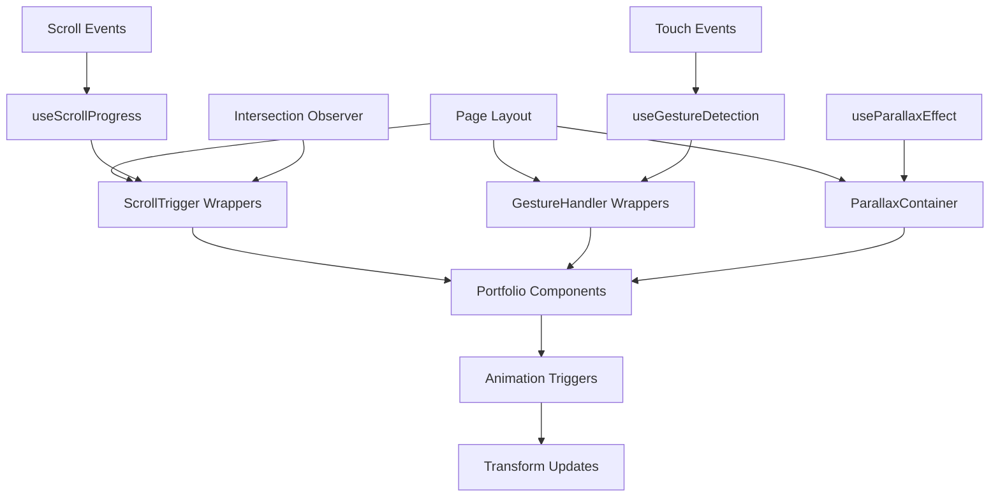

# User Story: 4 - Interact Through Scroll and Gesture

**As a** website visitor,
**I want** to trigger interactive animations through scrolling (desktop) and dragging (mobile),
**so that** I can actively engage with the content and have a dynamic browsing experience.

## Acceptance Criteria

* Scroll-triggered animations work smoothly on desktop devices
* Drag gesture animations function properly on mobile devices
* Animations include parallax, transform, or morphing effects
* Interactions are intuitive and enhance content discovery
* Performance remains smooth across different devices and browsers
* Animations provide clear visual feedback for user actions

## Notes

* Different interaction methods for desktop vs mobile ensure optimal UX for each platform
* Creative use of parallax and transform effects can showcase technical skills

## Implementation Plan

### 1. Feature Overview

This feature implements scroll-triggered and gesture-based interactions that create dynamic, engaging experiences tailored to different device types. Desktop users interact through scrolling while mobile users use touch gestures, both triggering sophisticated animations and content revelations.

### 2. Component Analysis & Reuse Strategy

**Existing Components:**
- All portfolio components will be enhanced with scroll/gesture interactions
- Animation system from Feature 3 will be extended with interaction triggers

**Enhancement Strategy:**
- **Modify Existing:** Add scroll/gesture triggers to existing portfolio components
- **New Components Required:** Scroll detection, gesture handlers, parallax controllers
- **Justification:** Builds upon existing foundation while adding sophisticated interaction layers

**Component Library Additions:**
- Scroll-triggered animation system
- Touch gesture recognition
- Parallax effect controllers
- Intersection observers for content revelation

### 3. Affected Files

- `[CREATE] src/app/_components/interactions/ScrollTrigger.tsx`
- `[CREATE] src/app/_components/interactions/ScrollTrigger.test.tsx`
- `[CREATE] src/app/_components/interactions/ScrollTrigger.visual.spec.ts`
- `[CREATE] src/app/_components/interactions/GestureHandler.tsx`
- `[CREATE] src/app/_components/interactions/GestureHandler.test.tsx`
- `[CREATE] src/app/_components/interactions/GestureHandler.visual.spec.ts`
- `[CREATE] src/app/_components/interactions/ParallaxContainer.tsx`
- `[CREATE] src/app/_components/interactions/ParallaxContainer.test.tsx`
- `[CREATE] src/app/_components/interactions/ParallaxContainer.visual.spec.ts`
- `[CREATE] src/hooks/useScrollProgress.ts`
- `[CREATE] src/hooks/useGestureDetection.ts`
- `[CREATE] src/hooks/useParallaxEffect.ts`
- `[CREATE] src/hooks/useIntersectionObserver.ts`
- `[CREATE] src/utils/scrollHelpers.ts`
- `[CREATE] src/utils/gestureHelpers.ts`
- `[MODIFY] src/app/_components/portfolio/ProfileHeader.tsx`
- `[MODIFY] src/app/_components/portfolio/SkillsSection.tsx`
- `[MODIFY] src/app/_components/portfolio/ExperienceSection.tsx`
- `[MODIFY] src/app/_components/portfolio/ProjectsSection.tsx`
- `[MODIFY] src/app/_components/portfolio/ContactSection.tsx`
- `[MODIFY] src/app/page.tsx`
- `[CREATE] src/styles/interactions.css`

### 4. Component Breakdown

**ScrollTrigger Component:**
- **Location:** `src/app/_components/interactions/ScrollTrigger.tsx`
- **Type:** Client Component (requires scroll event handling)
- **Responsibility:** Trigger animations based on scroll position and velocity
- **Props Interface:**
  ```typescript
  interface ScrollTriggerProps {
    children: React.ReactNode;
    trigger?: 'onEnter' | 'onExit' | 'onProgress' | 'whileInView';
    threshold?: number;
    rootMargin?: string;
    animation?: 'fade' | 'slide' | 'scale' | 'rotate' | 'custom';
    duration?: number;
    delay?: number;
    onTrigger?: (progress: number) => void;
  }
  ```

**GestureHandler Component:**
- **Location:** `src/app/_components/interactions/GestureHandler.tsx`
- **Type:** Client Component (touch event handling)
- **Responsibility:** Handle touch gestures and convert to animation triggers
- **Props Interface:**
  ```typescript
  interface GestureHandlerProps {
    children: React.ReactNode;
    gestures?: ('drag' | 'pinch' | 'swipe' | 'tap')[];
    onDrag?: (deltaX: number, deltaY: number) => void;
    onSwipe?: (direction: 'up' | 'down' | 'left' | 'right') => void;
    onPinch?: (scale: number) => void;
    sensitivity?: number;
  }
  ```

**ParallaxContainer Component:**
- **Location:** `src/app/_components/interactions/ParallaxContainer.tsx`
- **Type:** Client Component (scroll-based transforms)
- **Responsibility:** Create parallax effects based on scroll position
- **Props Interface:**
  ```typescript
  interface ParallaxContainerProps {
    children: React.ReactNode;
    speed?: number;
    direction?: 'vertical' | 'horizontal';
    offset?: number;
    easing?: 'linear' | 'easeOut' | 'easeInOut';
    disabled?: boolean;
  }
  ```

**useScrollProgress Hook:**
- **Location:** `src/hooks/useScrollProgress.ts`
- **Responsibility:** Track scroll progress and provide scroll-based values
- **Return Interface:**
  ```typescript
  interface ScrollProgress {
    scrollY: number;
    scrollProgress: number;
    scrollDirection: 'up' | 'down';
    scrollVelocity: number;
    isScrolling: boolean;
  }
  ```

**useGestureDetection Hook:**
- **Location:** `src/hooks/useGestureDetection.ts`
- **Responsibility:** Detect and interpret touch gestures
- **Return Interface:**
  ```typescript
  interface GestureDetection {
    isDragging: boolean;
    dragDistance: { x: number; y: number };
    gestureType: 'none' | 'drag' | 'swipe' | 'pinch';
    gestureProgress: number;
  }
  ```

### 5. Design Specifications

**Interaction Animation Colors:**

| Design Color | Semantic Purpose | Element | Implementation Method |
|--------------|-----------------|---------|------------------------|
| #1a1a2e | Base background | Scroll backgrounds | Direct hex value (#1a1a2e) |
| #e94560 | Active interaction | Progress indicators, active states | Direct hex value (#e94560) |
| #00f5ff | Scroll feedback | Scroll progress bars, indicators | Direct hex value (#00f5ff) |
| #ff6b9d | Gesture feedback | Touch interaction highlights | Direct hex value (#ff6b9d) |
| #3498db | Information | Scroll hints, instruction text | Direct hex value (#3498db) |
| #2ecc71 | Success | Completed interactions, achievements | Direct hex value (#2ecc71) |
| #f8f9fa | Content | Text during animations | Direct hex value (#f8f9fa) |
| #a8a8a8 | Subtle | Inactive states, placeholders | Direct hex value (#a8a8a8) |

**Animation Specifications:**
- **Scroll Speed:** 1px scroll = 0.5-2px transform depending on element
- **Parallax Multipliers:** Background (0.5x), midground (0.8x), foreground (1.2x)
- **Gesture Sensitivity:** 10px minimum drag distance, 100ms debounce
- **Animation Timing:** 300-600ms for triggered animations, real-time for scroll-based
- **Easing Functions:** Custom easing for natural feel (cubic-bezier(0.4, 0, 0.2, 1))

**Interaction Types:**
1. **Scroll Parallax:** Multi-layer depth with different scroll speeds
2. **Content Revelation:** Progressive disclosure as user scrolls
3. **Transform Animations:** Scale, rotate, translate based on scroll progress
4. **Gesture Morphing:** Content transforms based on drag direction/distance

### 6. Data Flow & State Management

**Additional Types Location:** `src/types/interactions.ts`

**Interaction Type Definitions:**
```typescript
interface ScrollTriggerConfig {
  element: HTMLElement;
  trigger: 'onEnter' | 'onExit' | 'onProgress' | 'whileInView';
  threshold: number;
  animation: AnimationConfig;
  callback?: (progress: number) => void;
}

interface GestureConfig {
  type: 'drag' | 'swipe' | 'pinch' | 'tap';
  sensitivity: number;
  threshold: number;
  callback: (event: GestureEvent) => void;
}

interface ParallaxLayer {
  element: HTMLElement;
  speed: number;
  direction: 'vertical' | 'horizontal';
  bounds?: { min: number; max: number };
}
```

**State Management:**
- **Scroll State:** Track scroll position, direction, velocity across components
- **Gesture State:** Monitor active gestures and touch interactions
- **Animation Coordination:** Prevent conflicting animations during interactions

### 7. API Endpoints & Contracts

No API endpoints required. All interactions are client-side event-driven.

### 8. Integration Diagram



### 9. Styling

**Interaction-Driven Animations:**
- **Transform Properties:** translateX, translateY, scale, rotate for smooth hardware acceleration
- **Scroll Indicators:** Progress bars and visual feedback for scroll position
- **Gesture Feedback:** Visual hints and responses for touch interactions
- **Performance:** will-change property for elements undergoing frequent transforms

**Responsive Interaction Design:**
- **Desktop:** Focus on scroll-triggered animations and parallax effects
- **Mobile:** Emphasize touch gestures and swipe interactions
- **Tablet:** Hybrid approach supporting both scroll and touch
- **Reduced Motion:** Respect user preferences and provide alternative interactions

**CSS Transform Optimization:**
```css
/* Hardware-accelerated scroll interactions */
.scroll-triggered {
  transform: translate3d(0, 0, 0);
  will-change: transform;
  transition-property: transform, opacity;
  transition-timing-function: cubic-bezier(0.4, 0, 0.2, 1);
}

/* Gesture-responsive elements */
.gesture-target {
  touch-action: manipulation;
  user-select: none;
  cursor: grab;
}

.gesture-target:active {
  cursor: grabbing;
}
```

### 10. Testing Strategy

**Interaction Tests:**
- `src/app/_components/interactions/ScrollTrigger.test.tsx` - Scroll event handling, animation triggers
- `src/app/_components/interactions/GestureHandler.test.tsx` - Touch gesture recognition, drag detection
- `src/app/_components/interactions/ParallaxContainer.test.tsx` - Parallax calculations, performance

**Behavior Tests:**
- Scroll position tracking accuracy
- Gesture recognition sensitivity and accuracy
- Animation timing and smoothness
- Cross-browser scroll/touch behavior
- Performance during continuous interactions

**Device-Specific Tests:**
- Desktop mouse wheel scroll behavior
- Mobile touch gesture recognition
- Tablet hybrid input support
- High-refresh rate display compatibility

### 11. Accessibility (A11y) Considerations

- **Motion Sensitivity:** Full support for `prefers-reduced-motion` with alternative interactions
- **Keyboard Navigation:** Ensure scroll animations don't interfere with keyboard users
- **Focus Management:** Maintain logical focus order during scroll-triggered content changes
- **Screen Readers:** Provide alternative ways to access scroll-revealed content
- **Touch Accessibility:** Support for assistive touch technologies
- **Gesture Alternatives:** Provide non-gesture ways to access gesture-triggered content

### 12. Security Considerations

- **Event Handling:** Prevent event handler memory leaks and performance issues
- **Touch Privacy:** Ensure touch data isn't logged or transmitted inappropriately
- **Performance DoS:** Rate limit scroll/gesture event processing
- **Input Validation:** Validate scroll and gesture data to prevent manipulation

### 13. Implementation Steps

**Implementation Checklist:**

**Phase 1: UI Implementation with Mock Data**

**1. Interaction Foundation:**
- [ ] Create `src/styles/interactions.css` with scroll and gesture utilities
- [ ] Define hardware-accelerated interaction properties
- [ ] Set up CSS custom properties for dynamic interaction values
- [ ] Create interaction performance monitoring utilities

**2. Scroll Interaction System:**
- [ ] Create `src/hooks/useScrollProgress.ts`
- [ ] Implement scroll position and velocity tracking
- [ ] Add scroll direction detection and debouncing
- [ ] Create `src/app/_components/interactions/ScrollTrigger.tsx`
- [ ] Implement intersection observer-based triggers
- [ ] Add animation orchestration for scroll events
- [ ] Create `src/app/_components/interactions/ParallaxContainer.tsx`
- [ ] Implement multi-layer parallax effects
- [ ] Add performance-optimized transform calculations

**3. Gesture Interaction System:**
- [ ] Create `src/hooks/useGestureDetection.ts`
- [ ] Implement touch event processing and gesture recognition
- [ ] Add gesture type classification (drag, swipe, pinch)
- [ ] Create `src/app/_components/interactions/GestureHandler.tsx`
- [ ] Implement touch gesture handling and response
- [ ] Add gesture feedback and visual hints

**4. Portfolio Integration:**
- [ ] Enhance `ProfileHeader.tsx` with scroll-triggered hero animations
- [ ] Add parallax effects for header background elements
- [ ] Enhance `SkillsSection.tsx` with scroll-triggered skill reveals
- [ ] Add drag interactions for skill exploration on mobile
- [ ] Enhance `ExperienceSection.tsx` with timeline scroll animations
- [ ] Add gesture-based experience card navigation
- [ ] Enhance `ProjectsSection.tsx` with scroll-based project reveals
- [ ] Add swipe gestures for project gallery navigation
- [ ] Enhance `ContactSection.tsx` with scroll-triggered contact animations

**5. Styling Implementation:**
- [ ] Verify interaction feedback colors match design system EXACTLY using direct hex values
- [ ] Apply hardware-accelerated transform properties for smooth interactions
- [ ] Implement scroll progress indicators with accurate positioning
- [ ] Set up gesture feedback animations with proper timing
- [ ] Add responsive interaction behavior for different devices
- [ ] Test interaction performance across viewport sizes

**6. Interaction Testing:**
- [ ] Create scroll behavior tests with various scroll patterns
- [ ] Test gesture recognition accuracy across different devices
- [ ] Verify animation timing and smoothness during interactions
- [ ] Test interaction conflicts and priority handling
- [ ] Add comprehensive interaction data-testid attributes
- [ ] Manual testing of scroll and gesture behaviors

**Phase 2: Advanced Interactions & Performance**

**7. Advanced Scroll Effects:**
- [ ] Implement scroll-based morphing animations
- [ ] Add intelligent scroll prediction for smooth animations
- [ ] Create context-aware scroll behaviors
- [ ] Add scroll-based audio feedback (optional)

**8. Advanced Gesture Recognition:**
- [ ] Implement multi-touch gesture support
- [ ] Add gesture velocity and momentum calculations
- [ ] Create custom gesture patterns for specific interactions
- [ ] Add haptic feedback integration for supported devices

**9. Performance Optimization:**
- [ ] Implement passive event listeners for better scroll performance
- [ ] Add intelligent animation frame management
- [ ] Optimize transform calculations and caching
- [ ] Test interaction performance on low-end devices

**10. Cross-Device Testing:**
- [ ] Test scroll behaviors across different input devices (trackpad, mouse, touch)
- [ ] Verify gesture recognition on various mobile devices and browsers
- [ ] Test interaction performance during device orientation changes
- [ ] Ensure interactions work with accessibility tools

### Playwright E2E & Visual Testing (for Scroll and Gesture Interactions)

**Visual Testing Strategy:**
- **Scroll Animation Testing:** Verify scroll-triggered animations activate at correct positions
- **Gesture Response Testing:** Test touch gesture recognition and visual feedback
- **Performance Validation:** Monitor animation smoothness during interactions
- **Cross-Device Testing:** Test interactions across Mobile (375x667px), Tablet (768x1024px), Desktop (1280x800px), Large (1920x1080px)

**Required Test Files:**
- `src/app/_components/interactions/ScrollTrigger.visual.spec.ts`
- `src/app/_components/interactions/GestureHandler.visual.spec.ts`
- `src/app/_components/interactions/ParallaxContainer.visual.spec.ts`

**Interaction Test Requirements:**
- Simulate scroll events and verify animation triggers
- Test touch gesture simulation and response accuracy
- Verify scroll progress indicators update correctly
- Test animation timing and visual feedback consistency
- Validate interaction accessibility features

**Performance Test Requirements:**
- Monitor scroll and gesture event processing performance
- Verify animation frame rates during continuous interactions
- Test memory usage during extended interaction sessions
- Validate interaction responsiveness across different device capabilities

### References

- Scroll animation libraries: GSAP ScrollTrigger, Framer Motion
- Gesture recognition: Hammer.js, React Spring gestures
- Performance optimization: Web Animation API, RequestAnimationFrame
- Accessibility: WCAG 2.1 motion and interaction guidelines
