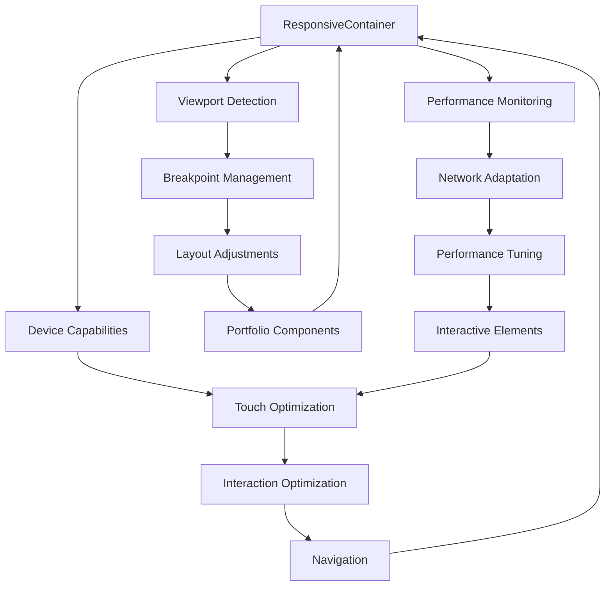

# User Story: 5 - Access Portfolio on Any Device

**As a** website visitor using any device (desktop, tablet, or mobile),
**I want** the portfolio to display and function perfectly on my screen size,
**so that** I can access Kent's professional information regardless of my device preference.

## Acceptance Criteria

* Layout adapts fluidly to desktop screen sizes
* Content displays properly on tablet devices in both portrait and landscape orientations
* Mobile phone interface is fully functional and easy to navigate
* Text remains readable across all screen sizes
* Interactive elements are appropriately sized for touch interfaces
* Navigation works seamlessly on all devices
* Performance is optimized for mobile networks

## Notes

* Responsive design is crucial for professional accessibility
* Different device users may have different priorities (quick mobile check vs detailed desktop review)

## Implementation Plan

### 1. Feature Overview

This feature ensures the portfolio provides an optimal viewing and interaction experience across all device types and screen sizes. The implementation focuses on responsive design principles, touch-friendly interfaces, and performance optimization for varying network conditions.

### 2. Component Analysis & Reuse Strategy

**Existing Components:**
- All portfolio components from previous features will be enhanced with responsive behavior
- Interactive and animation components will be adapted for touch interfaces

**Enhancement Strategy:**
- **Modify Existing:** Add responsive breakpoints and device-specific optimizations to all components
- **New Components Required:** Responsive layout containers, device-adaptive navigation, touch optimizations
- **Justification:** Building upon existing foundation while ensuring universal accessibility

**Component Library Additions:**
- Responsive grid system
- Device-adaptive navigation
- Touch-optimized interactive elements
- Performance monitoring for mobile networks

### 3. Affected Files

- `[CREATE] src/app/_components/layout/ResponsiveContainer.tsx`
- `[CREATE] src/app/_components/layout/ResponsiveContainer.test.tsx`
- `[CREATE] src/app/_components/layout/ResponsiveContainer.visual.spec.ts`
- `[CREATE] src/app/_components/navigation/AdaptiveNavigation.tsx`
- `[CREATE] src/app/_components/navigation/AdaptiveNavigation.test.tsx`
- `[CREATE] src/app/_components/navigation/AdaptiveNavigation.visual.spec.ts`
- `[CREATE] src/app/_components/ui/TouchOptimizedButton.tsx`
- `[CREATE] src/app/_components/ui/TouchOptimizedButton.test.tsx`
- `[CREATE] src/app/_components/ui/TouchOptimizedButton.visual.spec.ts`
- `[CREATE] src/hooks/useDeviceDetection.ts`
- `[CREATE] src/hooks/useResponsiveLayout.ts`
- `[CREATE] src/hooks/useNetworkStatus.ts`
- `[CREATE] src/utils/deviceHelpers.ts`
- `[CREATE] src/utils/performanceHelpers.ts`
- `[MODIFY] src/app/_components/portfolio/ProfileHeader.tsx`
- `[MODIFY] src/app/_components/portfolio/SkillsSection.tsx`
- `[MODIFY] src/app/_components/portfolio/ExperienceSection.tsx`
- `[MODIFY] src/app/_components/portfolio/ProjectsSection.tsx`
- `[MODIFY] src/app/_components/portfolio/ContactSection.tsx`
- `[MODIFY] src/app/_components/ui/InteractiveCard.tsx`
- `[MODIFY] src/app/_components/interactions/ScrollTrigger.tsx`
- `[MODIFY] src/app/_components/interactions/GestureHandler.tsx`
- `[MODIFY] src/app/page.tsx`
- `[MODIFY] src/app/layout.tsx`
- `[CREATE] src/styles/responsive.css`

### 4. Component Breakdown

**ResponsiveContainer Component:**
- **Location:** `src/app/_components/layout/ResponsiveContainer.tsx`
- **Type:** Server Component (layout structure)
- **Responsibility:** Provide responsive layout containers with device-adaptive behavior
- **Props Interface:**
  ```typescript
  interface ResponsiveContainerProps {
    children: React.ReactNode;
    maxWidth?: 'sm' | 'md' | 'lg' | 'xl' | 'full';
    padding?: 'none' | 'sm' | 'md' | 'lg';
    className?: string;
    as?: keyof JSX.IntrinsicElements;
  }
  ```

**AdaptiveNavigation Component:**
- **Location:** `src/app/_components/navigation/AdaptiveNavigation.tsx`
- **Type:** Client Component (device-specific behavior)
- **Responsibility:** Provide navigation that adapts to device capabilities and screen size
- **Props Interface:**
  ```typescript
  interface AdaptiveNavigationProps {
    items: NavigationItem[];
    variant?: 'desktop' | 'mobile' | 'auto';
    position?: 'top' | 'bottom' | 'side';
    collapsed?: boolean;
  }
  ```

**TouchOptimizedButton Component:**
- **Location:** `src/app/_components/ui/TouchOptimizedButton.tsx`
- **Type:** Client Component (touch interactions)
- **Responsibility:** Provide touch-friendly button interactions with appropriate sizing
- **Props Interface:**
  ```typescript
  interface TouchOptimizedButtonProps {
    children: React.ReactNode;
    size?: 'sm' | 'md' | 'lg' | 'touch';
    variant?: 'primary' | 'secondary' | 'ghost';
    touchTarget?: number; // minimum touch target size in pixels
    onClick?: () => void;
    disabled?: boolean;
  }
  ```

**useDeviceDetection Hook:**
- **Location:** `src/hooks/useDeviceDetection.ts`
- **Responsibility:** Detect device type, capabilities, and user preferences
- **Return Interface:**
  ```typescript
  interface DeviceDetection {
    deviceType: 'mobile' | 'tablet' | 'desktop';
    screenSize: 'xs' | 'sm' | 'md' | 'lg' | 'xl';
    touchCapable: boolean;
    orientation: 'portrait' | 'landscape';
    pixelRatio: number;
    prefersDarkMode: boolean;
    prefersReducedMotion: boolean;
  }
  ```

**useResponsiveLayout Hook:**
- **Location:** `src/hooks/useResponsiveLayout.ts`
- **Responsibility:** Provide responsive layout utilities and breakpoint management
- **Return Interface:**
  ```typescript
  interface ResponsiveLayout {
    breakpoint: 'xs' | 'sm' | 'md' | 'lg' | 'xl';
    isMobile: boolean;
    isTablet: boolean;
    isDesktop: boolean;
    windowSize: { width: number; height: number };
  }
  ```

### 5. Design Specifications

**Responsive Breakpoints:**

| Breakpoint | Min Width | Max Width | Device Target | Layout Adjustments |
|------------|-----------|-----------|---------------|-------------------|
| xs | 0px | 374px | Small phones | Single column, large touch targets |
| sm | 375px | 767px | Phones | Single column, optimized spacing |
| md | 768px | 1023px | Tablets | Two columns, hybrid interactions |
| lg | 1024px | 1439px | Small desktops | Multi-column, desktop interactions |
| xl | 1440px+ | ∞ | Large displays | Full layout, enhanced visuals |

**Touch Target Specifications:**

| Element Type | Minimum Size | Recommended Size | Spacing |
|--------------|--------------|------------------|---------|
| Buttons | 44px × 44px | 48px × 48px | 8px |
| Links | 44px × 44px | 48px × 48px | 4px |
| Form inputs | 44px height | 56px height | 16px |
| Navigation items | 48px × 48px | 56px × 56px | 4px |

**Typography Scaling:**

| Element | Mobile (sm) | Tablet (md) | Desktop (lg+) |
|---------|-------------|-------------|---------------|
| H1 Hero | 2.5rem | 3.5rem | 4rem |
| H2 Section | 1.75rem | 2rem | 2.5rem |
| H3 Subsection | 1.25rem | 1.375rem | 1.5rem |
| Body text | 1rem | 1rem | 1rem |
| Small text | 0.875rem | 0.875rem | 0.875rem |

**Responsive Colors (Same as Previous Features):**

| Design Color | Mobile Usage | Tablet Usage | Desktop Usage |
|--------------|--------------|--------------|---------------|
| #1a1a2e | Background | Background | Background |
| #16213e | Card backgrounds | Card backgrounds | Card backgrounds |
| #e94560 | Touch feedback | Hover/touch feedback | Hover feedback |
| #f8f9fa | Primary text | Primary text | Primary text |
| #a8a8a8 | Secondary text | Secondary text | Secondary text |

### 6. Data Flow & State Management

**Additional Types Location:** `src/types/responsive.ts`

**Responsive Type Definitions:**
```typescript
interface ViewportConfig {
  width: number;
  height: number;
  breakpoint: 'xs' | 'sm' | 'md' | 'lg' | 'xl';
  orientation: 'portrait' | 'landscape';
}

interface TouchTarget {
  minSize: number;
  recommendedSize: number;
  spacing: number;
}

interface PerformancePreferences {
  reducedMotion: boolean;
  lowDataMode: boolean;
  batteryLevel?: number;
  connectionType: 'slow' | 'fast' | 'unknown';
}
```

**State Management:**
- **Viewport State:** Track screen size, orientation, and breakpoint changes
- **Device Capabilities:** Monitor touch support, network conditions, battery status
- **User Preferences:** Respect system preferences for motion, data usage, accessibility

### 7. API Endpoints & Contracts

No API endpoints required. All responsive behavior is client-side based on viewport and device detection.

### 8. Integration Diagram



### 9. Styling

**Responsive Design System:**
- **Fluid Typography:** clamp() functions for smooth scaling between breakpoints
- **Flexible Layouts:** CSS Grid and Flexbox with responsive gap and spacing
- **Touch Optimization:** Minimum 44px touch targets with adequate spacing
- **Performance:** Conditional loading of heavy animations based on device capabilities

**CSS Custom Properties for Responsiveness:**
```css
:root {
  /* Responsive spacing scale */
  --space-xs: clamp(0.5rem, 2vw, 0.75rem);
  --space-sm: clamp(0.75rem, 2.5vw, 1rem);
  --space-md: clamp(1rem, 3vw, 1.5rem);
  --space-lg: clamp(1.5rem, 4vw, 2rem);
  --space-xl: clamp(2rem, 5vw, 3rem);

  /* Responsive typography */
  --text-xs: clamp(0.75rem, 2.5vw, 0.875rem);
  --text-sm: clamp(0.875rem, 3vw, 1rem);
  --text-base: clamp(1rem, 3.5vw, 1.125rem);
  --text-lg: clamp(1.125rem, 4vw, 1.25rem);
  --text-xl: clamp(1.25rem, 5vw, 1.5rem);

  /* Touch targets */
  --touch-target-min: 44px;
  --touch-target-recommended: 48px;
  --touch-spacing: 8px;
}
```

**Responsive Layout Patterns:**
- **Mobile-first approach:** Base styles for mobile, enhanced for larger screens
- **Container queries:** Use container queries where supported for component-level responsiveness
- **Intrinsic layouts:** Flexible grid systems that adapt to content
- **Progressive enhancement:** Enhanced interactions and animations for capable devices

### 10. Testing Strategy

**Responsive Tests:**
- `src/app/_components/layout/ResponsiveContainer.test.tsx` - Breakpoint behavior, layout adaptation
- `src/app/_components/navigation/AdaptiveNavigation.test.tsx` - Navigation adaptation across devices
- `src/app/_components/ui/TouchOptimizedButton.test.tsx` - Touch target sizing, accessibility

**Device Testing:**
- Viewport simulation across all breakpoints
- Touch interaction testing on simulated mobile devices
- Orientation change handling
- Network condition simulation and performance testing

**Cross-Browser Testing:**
- Modern mobile browsers (Safari, Chrome, Firefox, Edge)
- Tablet browsers with different viewport sizes
- Desktop browsers with responsive design tools

### 11. Accessibility (A11y) Considerations

- **Touch Accessibility:** Minimum 44px touch targets as per WCAG guidelines
- **Text Readability:** Maintain readable font sizes across all devices (minimum 16px)
- **Color Contrast:** Ensure contrast ratios remain compliant across different screen qualities
- **Navigation:** Keyboard and screen reader support across all device types
- **Motion Preferences:** Respect `prefers-reduced-motion` especially on mobile devices
- **Zoom Support:** Ensure layout works correctly at 200% zoom level

### 12. Security Considerations

- **Device Detection:** Avoid exposing sensitive device information
- **Performance Monitoring:** Ensure performance data isn't transmitted inappropriately
- **Network Awareness:** Respect user data preferences and privacy
- **Touch Data:** Prevent logging or transmission of touch interaction data

### 13. Implementation Steps

**Implementation Checklist:**

**Phase 1: UI Implementation with Mock Data**

**1. Responsive Foundation:**
- [ ] Create `src/styles/responsive.css` with responsive utilities
- [ ] Define CSS custom properties for responsive scaling
- [ ] Set up breakpoint system and viewport utilities
- [ ] Create responsive grid and layout components

**2. Device Detection System:**
- [ ] Create `src/hooks/useDeviceDetection.ts`
- [ ] Implement viewport size and orientation tracking
- [ ] Add device capability detection (touch, network, battery)
- [ ] Create `src/hooks/useResponsiveLayout.ts`
- [ ] Implement breakpoint management and layout utilities
- [ ] Add responsive state management

**3. Responsive Layout Components:**
- [ ] Create `src/app/_components/layout/ResponsiveContainer.tsx`
- [ ] Implement fluid container system with max-width constraints
- [ ] Add responsive padding and margin management
- [ ] Create `src/app/_components/navigation/AdaptiveNavigation.tsx`
- [ ] Implement mobile-first navigation with progressive enhancement
- [ ] Add touch-friendly navigation interactions

**4. Touch Optimization:**
- [ ] Create `src/app/_components/ui/TouchOptimizedButton.tsx`
- [ ] Implement minimum 44px touch targets with proper spacing
- [ ] Add touch-specific interaction states and feedback
- [ ] Enhance existing interactive components with touch optimization
- [ ] Update InteractiveCard, ScrollTrigger, and GestureHandler for touch

**5. Portfolio Component Enhancement:**
- [ ] Modify `ProfileHeader.tsx` for responsive hero section
- [ ] Implement fluid typography and responsive spacing
- [ ] Add mobile-optimized layout with portrait/landscape support
- [ ] Modify `SkillsSection.tsx` for responsive grid layouts
- [ ] Implement adaptive skill card sizing and touch interactions
- [ ] Add swipe navigation for mobile skill exploration
- [ ] Modify `ExperienceSection.tsx` for responsive timeline
- [ ] Implement adaptive experience card layouts for different screen sizes
- [ ] Add touch-friendly experience navigation
- [ ] Modify `ProjectsSection.tsx` for responsive project grid
- [ ] Implement adaptive project card sizing and mobile gallery
- [ ] Add touch-optimized project interaction
- [ ] Modify `ContactSection.tsx` for responsive contact layout
- [ ] Implement touch-friendly contact interactions

**6. Styling Implementation:**
- [ ] Verify responsive colors match design system EXACTLY across all breakpoints
- [ ] Apply fluid typography scaling using clamp() functions
- [ ] Implement responsive spacing using CSS custom properties
- [ ] Set up touch target sizing (minimum 44px, recommended 48px)
- [ ] Add responsive layout patterns (mobile-first approach)
- [ ] Test responsive behavior across all breakpoints
- [ ] Ensure proper spacing and touch target accessibility

**7. Responsive Testing:**
- [ ] Create responsive behavior tests for all portfolio components
- [ ] Test breakpoint transitions and layout adaptations
- [ ] Verify touch target sizing and accessibility
- [ ] Test orientation change handling
- [ ] Add comprehensive responsive data-testid attributes
- [ ] Manual testing across device types and screen sizes

**Phase 2: Performance & Advanced Responsive Features**

**8. Performance Optimization:**
- [ ] Implement network-aware loading strategies
- [ ] Add image optimization for different screen densities
- [ ] Optimize animation and interaction performance for mobile
- [ ] Add progressive loading for enhanced features

**9. Advanced Responsive Features:**
- [ ] Implement container queries for component-level responsiveness
- [ ] Add advanced gesture support for tablet devices
- [ ] Create responsive animation scaling based on device capabilities
- [ ] Add responsive performance monitoring

**10. Cross-Device Testing:**
- [ ] Test on actual mobile devices (iOS Safari, Android Chrome)
- [ ] Verify tablet experience in both portrait and landscape
- [ ] Test desktop experience across different monitor sizes
- [ ] Verify performance on low-end mobile devices

**11. Accessibility Validation:**
- [ ] Test with screen readers on mobile devices
- [ ] Verify keyboard navigation on touch devices with external keyboards
- [ ] Test with assistive touch technologies
- [ ] Validate color contrast across different screen types

### Playwright E2E & Visual Testing (for Responsive Design)

**Visual Testing Strategy:**
- **Breakpoint Testing:** Test layout across all defined breakpoints (375px, 768px, 1024px, 1440px+)
- **Orientation Testing:** Verify tablet layouts in both portrait and landscape orientations
- **Touch Target Validation:** Ensure interactive elements meet minimum size requirements
- **Typography Scaling:** Verify text remains readable and properly scaled across devices

**Required Test Files:**
- `src/app/_components/layout/ResponsiveContainer.visual.spec.ts`
- `src/app/_components/navigation/AdaptiveNavigation.visual.spec.ts`
- `src/app/_components/ui/TouchOptimizedButton.visual.spec.ts`

**Responsive Test Requirements:**
- Test all components across Mobile (375x667px), Tablet (768x1024px), Desktop (1280x800px), Large (1920x1080px)
- Verify touch target sizes meet accessibility guidelines (minimum 44px)
- Test layout adaptation and content reflow at each breakpoint
- Validate typography scaling and readability
- Test interactive element accessibility across device types

**Performance Test Requirements:**
- Monitor rendering performance across different viewport sizes
- Test animation and interaction performance on simulated mobile devices
- Verify memory usage during responsive layout changes
- Test loading performance with network throttling

### References

- Responsive design principles: Mobile-first design, progressive enhancement
- Touch interface guidelines: Apple Human Interface Guidelines, Material Design
- Web accessibility: WCAG 2.1 AA guidelines for touch and responsive design
- Performance optimization: Core Web Vitals, mobile performance best practices
