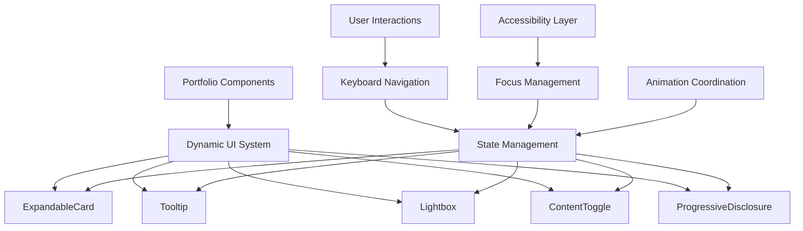

# User Story: 6 - Interact with Dynamic UI Elements

**As a** website visitor,
**I want** to interact with dynamic UI elements like expandable cards, tooltips, and lightboxes,
**so that** I can explore content in depth without being overwhelmed by static text blocks.

## Acceptance Criteria

* Interactive cards expand to reveal additional information when clicked/tapped
* Tooltips provide helpful context for technical terms and skills
* Lightbox functionality displays project images and details
* Toggle elements allow users to control information density
* Interactive elements provide clear visual feedback on hover/interaction
* All interactions work smoothly without page reloads
* Elements are keyboard accessible for accessibility compliance

## Notes

* Replaces traditional static text presentation
* Allows users to control their information consumption experience
* Demonstrates technical interaction design skills

## Implementation Plan

### 1. Feature Overview

This feature creates a rich interactive experience by implementing dynamic UI elements that allow users to explore content progressively. Users can expand cards, view tooltips, browse project galleries, and control information density through elegant, accessible interactions.

### 2. Component Analysis & Reuse Strategy

**Existing Components:**
- `InteractiveCard` from Feature 2 will be enhanced with expansion capabilities
- Touch-optimized components from Feature 5 will be extended with complex interactions
- All portfolio components will be enhanced with dynamic content revelation

**Enhancement Strategy:**
- **Extend Existing:** Build upon InteractiveCard and TouchOptimizedButton foundations
- **New Components Required:** Expandable cards, tooltips, lightboxes, content toggles
- **Justification:** Leverages existing interaction framework while adding sophisticated content management

**Component Library Additions:**
- Expandable content containers
- Tooltip and popover systems
- Modal and lightbox components
- Progressive disclosure controls

### 3. Affected Files

- `[CREATE] src/app/_components/ui/ExpandableCard.tsx`
- `[CREATE] src/app/_components/ui/ExpandableCard.test.tsx`
- `[CREATE] src/app/_components/ui/ExpandableCard.visual.spec.ts`
- `[CREATE] src/app/_components/ui/Tooltip.tsx`
- `[CREATE] src/app/_components/ui/Tooltip.test.tsx`
- `[CREATE] src/app/_components/ui/Tooltip.visual.spec.ts`
- `[CREATE] src/app/_components/ui/Lightbox.tsx`
- `[CREATE] src/app/_components/ui/Lightbox.test.tsx`
- `[CREATE] src/app/_components/ui/Lightbox.visual.spec.ts`
- `[CREATE] src/app/_components/ui/ContentToggle.tsx`
- `[CREATE] src/app/_components/ui/ContentToggle.test.tsx`
- `[CREATE] src/app/_components/ui/ContentToggle.visual.spec.ts`
- `[CREATE] src/app/_components/ui/ProgressiveDisclosure.tsx`
- `[CREATE] src/app/_components/ui/ProgressiveDisclosure.test.tsx`
- `[CREATE] src/app/_components/ui/ProgressiveDisclosure.visual.spec.ts`
- `[CREATE] src/hooks/useExpandableState.ts`
- `[CREATE] src/hooks/useTooltip.ts`
- `[CREATE] src/hooks/useLightbox.ts`
- `[CREATE] src/hooks/useKeyboardNavigation.ts`
- `[CREATE] src/utils/animationUtils.ts`
- `[CREATE] src/utils/accessibilityUtils.ts`
- `[MODIFY] src/app/_components/portfolio/ProfileHeader.tsx`
- `[MODIFY] src/app/_components/portfolio/SkillsSection.tsx`
- `[MODIFY] src/app/_components/portfolio/ExperienceSection.tsx`
- `[MODIFY] src/app/_components/portfolio/ProjectsSection.tsx`
- `[MODIFY] src/app/_components/portfolio/ContactSection.tsx`
- `[MODIFY] src/app/_components/ui/InteractiveCard.tsx`
- `[CREATE] src/styles/dynamic-interactions.css`

### 4. Component Breakdown

**ExpandableCard Component:**
- **Location:** `src/app/_components/ui/ExpandableCard.tsx`
- **Type:** Client Component (interactive state management)
- **Responsibility:** Provide smooth expand/collapse functionality with content preservation
- **Props Interface:**
  ```typescript
  interface ExpandableCardProps {
    children: React.ReactNode;
    summary: React.ReactNode;
    expandedContent: React.ReactNode;
    defaultExpanded?: boolean;
    animationDuration?: number;
    onToggle?: (expanded: boolean) => void;
    className?: string;
    disabled?: boolean;
  }
  ```

**Tooltip Component:**
- **Location:** `src/app/_components/ui/Tooltip.tsx`
- **Type:** Client Component (positioning and interaction)
- **Responsibility:** Display contextual information with intelligent positioning
- **Props Interface:**
  ```typescript
  interface TooltipProps {
    children: React.ReactNode;
    content: React.ReactNode;
    position?: 'top' | 'bottom' | 'left' | 'right' | 'auto';
    trigger?: 'hover' | 'click' | 'focus';
    delay?: number;
    offset?: number;
    className?: string;
  }
  ```

**Lightbox Component:**
- **Location:** `src/app/_components/ui/Lightbox.tsx`
- **Type:** Client Component (modal management)
- **Responsibility:** Display media and content in fullscreen overlay with navigation
- **Props Interface:**
  ```typescript
  interface LightboxProps {
    items: LightboxItem[];
    initialIndex?: number;
    onClose?: () => void;
    className?: string;
    showNavigation?: boolean;
    showThumbnails?: boolean;
  }

  interface LightboxItem {
    type: 'image' | 'video' | 'content';
    src?: string;
    alt?: string;
    title?: string;
    description?: string;
    content?: React.ReactNode;
  }
  ```

**ContentToggle Component:**
- **Location:** `src/app/_components/ui/ContentToggle.tsx`
- **Type:** Client Component (content state management)
- **Responsibility:** Allow users to toggle between different content views or densities
- **Props Interface:**
  ```typescript
  interface ContentToggleProps {
    options: ToggleOption[];
    defaultOption?: string;
    orientation?: 'horizontal' | 'vertical';
    onChange?: (option: string) => void;
    className?: string;
  }

  interface ToggleOption {
    id: string;
    label: string;
    icon?: React.ReactNode;
    content: React.ReactNode;
  }
  ```

**ProgressiveDisclosure Component:**
- **Location:** `src/app/_components/ui/ProgressiveDisclosure.tsx`
- **Type:** Client Component (progressive content revelation)
- **Responsibility:** Gradually reveal content based on user interaction or scroll position
- **Props Interface:**
  ```typescript
  interface ProgressiveDisclosureProps {
    sections: DisclosureSection[];
    revealTrigger?: 'click' | 'scroll' | 'hover';
    animationDelay?: number;
    className?: string;
  }

  interface DisclosureSection {
    id: string;
    title: string;
    content: React.ReactNode;
    priority: number;
  }
  ```

### 5. Design Specifications

**Dynamic Interaction Colors:**

| Design Color | Semantic Purpose | Element | Implementation Method |
|--------------|-----------------|---------|------------------------|
| #1a1a2e | Base background | Card backgrounds, modal overlays | Direct hex value (#1a1a2e) |
| #16213e | Secondary background | Expanded card content, tooltip backgrounds | Direct hex value (#16213e) |
| #e94560 | Active state | Expanded indicators, active toggles | Direct hex value (#e94560) |
| #00f5ff | Interactive feedback | Tooltip borders, lightbox controls | Direct hex value (#00f5ff) |
| #ff6b9d | Hover state | Card hover, button hover states | Direct hex value (#ff6b9d) |
| #f8f9fa | Primary text | Card content, tooltip text | Direct hex value (#f8f9fa) |
| #a8a8a8 | Secondary text | Subtitle, meta information | Direct hex value (#a8a8a8) |
| #4d4d4d | Border/separator | Card borders, tooltip arrows | Direct hex value (#4d4d4d) |
| #2ecc71 | Success state | Successful interactions, completed actions | Direct hex value (#2ecc71) |
| #3498db | Information | Info tooltips, help indicators | Direct hex value (#3498db) |

**Animation Specifications:**
- **Card Expansion:** 300-400ms smooth height transition with easing
- **Tooltip Appearance:** 150ms fade-in with slight scale animation
- **Lightbox Transitions:** 250ms fade with backdrop blur effect
- **Content Toggle:** 200ms cross-fade between content states
- **Progressive Disclosure:** Staggered animations with 100ms delays between sections

**Interactive Element Sizing:**
- **Expandable Cards:** Minimum 300px width, adaptive height
- **Tooltips:** Maximum 300px width, adaptive height with word wrap
- **Lightbox:** Full viewport with 5% padding on desktop, full screen on mobile
- **Toggle Buttons:** Minimum 44px touch targets, 8px spacing
- **Disclosure Triggers:** Minimum 48px height for touch accessibility

### 6. Data Flow & State Management

**Additional Types Location:** `src/types/dynamic-ui.ts`

**Dynamic UI Type Definitions:**
```typescript
interface ExpandableState {
  isExpanded: boolean;
  isAnimating: boolean;
  contentHeight: number;
}

interface TooltipState {
  isVisible: boolean;
  position: { x: number; y: number };
  placement: 'top' | 'bottom' | 'left' | 'right';
}

interface LightboxState {
  isOpen: boolean;
  currentIndex: number;
  items: LightboxItem[];
  isLoading: boolean;
}

interface ContentState {
  activeView: string;
  transitionState: 'idle' | 'transitioning' | 'complete';
  visibleSections: string[];
}
```

**State Management:**
- **Component-Level State:** Each dynamic element manages its own interaction state
- **Keyboard Navigation:** Global keyboard handler for accessibility
- **Focus Management:** Proper focus trapping and restoration for modals
- **Animation Coordination:** Prevent conflicting animations and manage timing

### 7. API Endpoints & Contracts

No API endpoints required. All dynamic interactions are client-side with local state management.

### 8. Integration Diagram



### 9. Styling

**Dynamic Interaction Styling:**
- **Card Animations:** Smooth height transitions using CSS transitions and max-height
- **Tooltip Positioning:** Dynamic positioning with collision detection and arrow indicators
- **Lightbox Styling:** Full-screen overlay with backdrop blur and smooth transitions
- **Toggle Animations:** Cross-fade effects with opacity and transform properties
- **Focus Indicators:** Clear, high-contrast focus rings for keyboard navigation

**CSS Animation Utilities:**
```css
/* Expandable card animations */
.expandable-card {
  transition: height 300ms cubic-bezier(0.4, 0, 0.2, 1);
  overflow: hidden;
}

.expandable-card.expanding {
  transition-duration: 400ms;
}

/* Tooltip animations */
.tooltip {
  opacity: 0;
  transform: translateY(-4px) scale(0.95);
  transition: opacity 150ms ease-out, transform 150ms ease-out;
}

.tooltip.visible {
  opacity: 1;
  transform: translateY(0) scale(1);
}

/* Lightbox animations */
.lightbox-backdrop {
  backdrop-filter: blur(8px);
  transition: backdrop-filter 250ms ease-out;
}

.lightbox-content {
  transform: scale(0.9);
  opacity: 0;
  transition: transform 250ms ease-out, opacity 250ms ease-out;
}

.lightbox-content.visible {
  transform: scale(1);
  opacity: 1;
}
```

### 10. Testing Strategy

**Dynamic Interaction Tests:**
- `src/app/_components/ui/ExpandableCard.test.tsx` - Expansion logic, animation states, accessibility
- `src/app/_components/ui/Tooltip.test.tsx` - Positioning, trigger events, content display
- `src/app/_components/ui/Lightbox.test.tsx` - Modal behavior, navigation, keyboard handling
- `src/app/_components/ui/ContentToggle.test.tsx` - Toggle state, content switching, accessibility
- `src/app/_components/ui/ProgressiveDisclosure.test.tsx` - Content revelation, timing, scroll triggers

**Interaction Behavior Tests:**
- Mouse and keyboard interaction testing
- Touch gesture compatibility for mobile devices
- Animation timing and smoothness verification
- Focus management and accessibility compliance
- State persistence during component updates

**Cross-Browser Testing:**
- Modern browser compatibility for CSS animations
- Touch device compatibility for mobile interactions
- Keyboard navigation across different browsers
- Screen reader compatibility testing

### 11. Accessibility (A11y) Considerations

- **Keyboard Navigation:** Full keyboard support with Tab, Enter, Escape, and arrow key handling
- **Screen Readers:** Proper ARIA labels, live regions for dynamic content changes
- **Focus Management:** Focus trapping in modals, proper focus restoration
- **Reduced Motion:** Respect `prefers-reduced-motion` with alternative interaction patterns
- **High Contrast:** Ensure interactive elements remain visible in high contrast mode
- **Touch Accessibility:** Minimum 44px touch targets with adequate spacing

### 12. Security Considerations

- **Content Sanitization:** Sanitize any user-provided content in tooltips and modals
- **XSS Prevention:** Validate and escape dynamic content to prevent script injection
- **Event Handling:** Proper event listener cleanup to prevent memory leaks
- **Focus Security:** Prevent focus hijacking and ensure proper focus management

### 13. Implementation Steps

**Implementation Checklist:**

**Phase 1: UI Implementation with Mock Data**

**1. Dynamic UI Foundation:**
- [ ] Create `src/styles/dynamic-interactions.css` with animation utilities
- [ ] Define CSS custom properties for dynamic element styling
- [ ] Set up animation timing and easing functions
- [ ] Create accessibility utilities for dynamic content

**2. Core Dynamic Components:**
- [ ] Create `src/app/_components/ui/ExpandableCard.tsx`
- [ ] Implement smooth expand/collapse with height transitions
- [ ] Add keyboard accessibility and ARIA attributes
- [ ] Create `src/app/_components/ui/Tooltip.tsx`
- [ ] Implement intelligent positioning with collision detection
- [ ] Add multiple trigger types (hover, click, focus)
- [ ] Create `src/app/_components/ui/Lightbox.tsx`
- [ ] Implement modal behavior with backdrop and focus trapping
- [ ] Add navigation controls and keyboard handling
- [ ] Create `src/app/_components/ui/ContentToggle.tsx`
- [ ] Implement toggle state management with smooth transitions
- [ ] Add keyboard navigation and accessibility
- [ ] Create `src/app/_components/ui/ProgressiveDisclosure.tsx`
- [ ] Implement content revelation with timing controls
- [ ] Add scroll-based and interaction-based triggers

**3. State Management Hooks:**
- [ ] Create `src/hooks/useExpandableState.ts`
- [ ] Implement expansion state management and animation control
- [ ] Add height calculation and smooth transitions
- [ ] Create `src/hooks/useTooltip.ts`
- [ ] Implement tooltip positioning and visibility management
- [ ] Add collision detection and intelligent placement
- [ ] Create `src/hooks/useLightbox.ts`
- [ ] Implement modal state management and navigation
- [ ] Add keyboard event handling and focus management
- [ ] Create `src/hooks/useKeyboardNavigation.ts`
- [ ] Implement global keyboard navigation for dynamic elements
- [ ] Add focus management utilities

**4. Portfolio Integration:**
- [ ] Enhance `ProfileHeader.tsx` with expandable bio section
- [ ] Add tooltips for contact information and social links
- [ ] Enhance `SkillsSection.tsx` with expandable skill details
- [ ] Add tooltips for technical terms and skill descriptions
- [ ] Create skill proficiency indicators with progressive disclosure
- [ ] Enhance `ExperienceSection.tsx` with expandable job descriptions
- [ ] Add lightbox for company logos and project screenshots
- [ ] Create detailed achievement disclosure sections
- [ ] Enhance `ProjectsSection.tsx` with expandable project details
- [ ] Add lightbox gallery for project images and demos
- [ ] Create technology tooltips and detailed descriptions
- [ ] Enhance `ContactSection.tsx` with expandable contact methods
- [ ] Add tooltips for availability and preferred contact methods

**5. Styling Implementation:**
- [ ] Verify dynamic element colors match design system EXACTLY using direct hex values
- [ ] Apply smooth animation timing with proper easing functions
- [ ] Implement responsive dynamic elements for different screen sizes
- [ ] Set up proper z-index management for modals and tooltips
- [ ] Add focus indicators that meet accessibility contrast requirements
- [ ] Test animation performance across devices

**6. Dynamic Interaction Testing:**
- [ ] Create comprehensive tests for all dynamic components
- [ ] Test keyboard navigation and accessibility features
- [ ] Verify animation timing and smoothness
- [ ] Test responsive behavior for dynamic elements
- [ ] Add comprehensive data-testid attributes for dynamic states
- [ ] Manual testing of complex interaction patterns

**Phase 2: Advanced Dynamic Features & Polish**

**7. Advanced Interactions:**
- [ ] Implement drag-to-reorder for expandable content
- [ ] Add gesture-based interactions for mobile devices
- [ ] Create contextual help system with smart tooltips
- [ ] Add keyboard shortcuts for power users

**8. Performance Optimization:**
- [ ] Implement lazy loading for expandable content
- [ ] Optimize animation performance with GPU acceleration
- [ ] Add intelligent pre-loading for lightbox content
- [ ] Optimize memory usage for large dynamic content sets

**9. Enhanced Accessibility:**
- [ ] Add comprehensive screen reader announcements
- [ ] Implement smart focus management for complex interactions
- [ ] Add high contrast mode support
- [ ] Test with multiple assistive technologies

**10. Cross-Device Testing:**
- [ ] Test dynamic elements on various touch devices
- [ ] Verify keyboard interactions on desktop browsers
- [ ] Test animation performance on low-end devices
- [ ] Ensure dynamic content works with different input methods

### Playwright E2E & Visual Testing (for Dynamic UI Elements)

**Visual Testing Strategy:**
- **Interaction State Testing:** Test default, expanded, active, and hover states for all dynamic elements
- **Animation Verification:** Validate smooth transitions and animation timing
- **Tooltip Positioning:** Verify intelligent positioning and collision detection
- **Modal Behavior:** Test lightbox functionality and focus management
- **Responsive Adaptation:** Test dynamic elements across Mobile (375x667px), Tablet (768x1024px), Desktop (1280x800px), Large (1920x1080px)

**Required Test Files:**
- `src/app/_components/ui/ExpandableCard.visual.spec.ts`
- `src/app/_components/ui/Tooltip.visual.spec.ts`
- `src/app/_components/ui/Lightbox.visual.spec.ts`
- `src/app/_components/ui/ContentToggle.visual.spec.ts`
- `src/app/_components/ui/ProgressiveDisclosure.visual.spec.ts`

**Interaction Test Requirements:**
- Simulate click events and verify expansion/collapse behavior
- Test keyboard navigation (Tab, Enter, Escape, Arrow keys)
- Verify tooltip positioning and content display
- Test lightbox navigation and modal behavior
- Validate focus management and accessibility features

**Animation Test Requirements:**
- Monitor animation timing and smoothness
- Verify proper easing functions and transitions
- Test animation performance across different viewport sizes
- Validate reduced motion preferences are respected

### References

- Interaction design principles: Material Design, Apple Human Interface Guidelines
- Animation best practices: Web Animations API, CSS Transitions and Transforms
- Accessibility standards: WCAG 2.1 AA for interactive elements, ARIA best practices
- Modal and tooltip patterns: Accessible modal implementations, tooltip positioning algorithms
