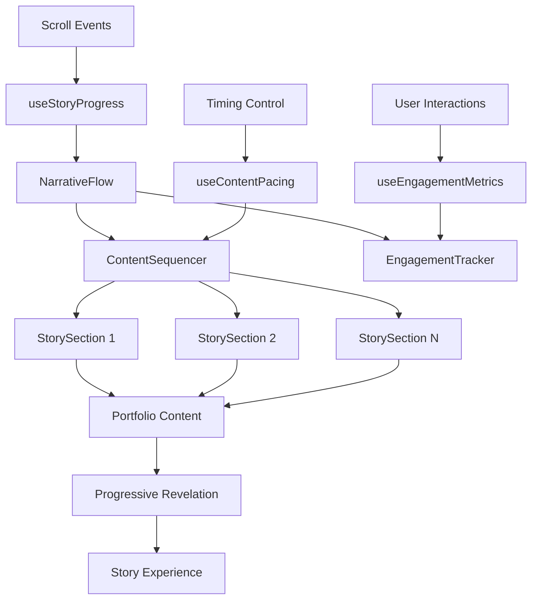

# User Story: 7 - Experience Progressive Content Revelation

**As a** website visitor,
**I want** content to appear progressively as I scroll through the page,
**so that** I remain engaged and can consume information at a comfortable pace without feeling overwhelmed.

## Acceptance Criteria

* Key information is summarized and presented in digestible chunks
* Content reveals progressively as user scrolls down the page
* Motion and transitions keep the user engaged during content consumption
* Long blocks of text are broken into dynamic, animated sections
* Scroll-based transitions are smooth and purposeful
* Information hierarchy guides users naturally through the content
* Loading states and animations provide visual interest during content revelation

## Notes

* Prevents overwhelming users with long sticky blocks of text
* Creates a storytelling experience through the portfolio
* Maintains engagement through motion and progressive disclosure

## Implementation Plan

### 1. Feature Overview

This feature creates a cinematic, story-driven experience where content reveals progressively as users scroll, maintaining engagement through carefully orchestrated animations and content pacing. The implementation transforms the traditional static portfolio into an interactive narrative.

### 2. Component Analysis & Reuse Strategy

**Existing Components:**
- ScrollTrigger from Feature 4 will be the foundation for progressive revelation
- ProgressiveDisclosure from Feature 6 will be enhanced for scroll-based reveals
- All portfolio components will be restructured for progressive storytelling

**Enhancement Strategy:**
- **Extend Existing:** Build upon ScrollTrigger and ProgressiveDisclosure components
- **New Components Required:** Story sections, content sequencing, narrative flow controllers
- **Justification:** Leverages existing scroll interaction system while adding sophisticated content orchestration

**Component Library Additions:**
- Narrative section containers
- Content sequencing systems
- Story flow controllers
- Engagement tracking and pacing

### 3. Affected Files

- `[CREATE] src/app/_components/story/StorySection.tsx`
- `[CREATE] src/app/_components/story/StorySection.test.tsx`
- `[CREATE] src/app/_components/story/StorySection.visual.spec.ts`
- `[CREATE] src/app/_components/story/ContentSequencer.tsx`
- `[CREATE] src/app/_components/story/ContentSequencer.test.tsx`
- `[CREATE] src/app/_components/story/ContentSequencer.visual.spec.ts`
- `[CREATE] src/app/_components/story/NarrativeFlow.tsx`
- `[CREATE] src/app/_components/story/NarrativeFlow.test.tsx`
- `[CREATE] src/app/_components/story/NarrativeFlow.visual.spec.ts`
- `[CREATE] src/app/_components/story/EngagementTracker.tsx`
- `[CREATE] src/app/_components/story/EngagementTracker.test.tsx`
- `[CREATE] src/app/_components/story/EngagementTracker.visual.spec.ts`
- `[CREATE] src/hooks/useStoryProgress.ts`
- `[CREATE] src/hooks/useContentPacing.ts`
- `[CREATE] src/hooks/useEngagementMetrics.ts`
- `[CREATE] src/utils/storyHelpers.ts`
- `[CREATE] src/utils/contentPacing.ts`
- `[MODIFY] src/app/_components/portfolio/ProfileHeader.tsx`
- `[MODIFY] src/app/_components/portfolio/SkillsSection.tsx`
- `[MODIFY] src/app/_components/portfolio/ExperienceSection.tsx`
- `[MODIFY] src/app/_components/portfolio/ProjectsSection.tsx`
- `[MODIFY] src/app/_components/portfolio/ContactSection.tsx`
- `[MODIFY] src/app/_components/interactions/ScrollTrigger.tsx`
- `[MODIFY] src/app/_components/ui/ProgressiveDisclosure.tsx`
- `[MODIFY] src/app/page.tsx`
- `[CREATE] src/styles/story-progression.css`

### 4. Component Breakdown

**StorySection Component:**
- **Location:** `src/app/_components/story/StorySection.tsx`
- **Type:** Client Component (scroll-based animations)
- **Responsibility:** Create narrative sections with progressive revelation and storytelling elements
- **Props Interface:**
  ```typescript
  interface StorySectionProps {
    children: React.ReactNode;
    title?: string;
    subtitle?: string;
    sectionId: string;
    revealTrigger?: 'scroll' | 'sequence' | 'manual';
    revealDelay?: number;
    animationType?: 'fade' | 'slide' | 'scale' | 'stagger' | 'typewriter';
    priority: number;
    dependencies?: string[];
    onReveal?: () => void;
    className?: string;
  }
  ```

**ContentSequencer Component:**
- **Location:** `src/app/_components/story/ContentSequencer.tsx`
- **Type:** Client Component (sequence orchestration)
- **Responsibility:** Orchestrate the timing and order of content revelation across sections
- **Props Interface:**
  ```typescript
  interface ContentSequencerProps {
    sections: SequenceSection[];
    globalPacing?: 'slow' | 'medium' | 'fast' | 'auto';
    autoProgress?: boolean;
    userControlled?: boolean;
    onSequenceComplete?: () => void;
    className?: string;
  }

  interface SequenceSection {
    id: string;
    content: React.ReactNode;
    revealCondition: RevealCondition;
    timing: TimingConfig;
  }
  ```

**NarrativeFlow Component:**
- **Location:** `src/app/_components/story/NarrativeFlow.tsx`
- **Type:** Client Component (story orchestration)
- **Responsibility:** Manage the overall narrative structure and flow between sections
- **Props Interface:**
  ```typescript
  interface NarrativeFlowProps {
    chapters: StoryChapter[];
    currentChapter?: string;
    navigationStyle?: 'linear' | 'branching' | 'free';
    progressIndicator?: boolean;
    onChapterChange?: (chapter: string) => void;
    className?: string;
  }

  interface StoryChapter {
    id: string;
    title: string;
    sections: string[];
    prerequisites?: string[];
    estimated_reading_time: number;
  }
  ```

**EngagementTracker Component:**
- **Location:** `src/app/_components/story/EngagementTracker.tsx`
- **Type:** Client Component (analytics and pacing)
- **Responsibility:** Track user engagement and adjust content pacing dynamically
- **Props Interface:**
  ```typescript
  interface EngagementTrackerProps {
    trackingId: string;
    adaptivePacing?: boolean;
    engagementThresholds?: EngagementThresholds;
    onEngagementChange?: (metrics: EngagementMetrics) => void;
  }

  interface EngagementMetrics {
    timeOnSection: number;
    scrollProgress: number;
    interactionCount: number;
    returnVisits: number;
    completionRate: number;
  }
  ```

**useStoryProgress Hook:**
- **Location:** `src/hooks/useStoryProgress.ts`
- **Responsibility:** Track overall story progression and user journey
- **Return Interface:**
  ```typescript
  interface StoryProgress {
    currentChapter: string;
    completedSections: string[];
    overallProgress: number;
    estimatedTimeRemaining: number;
    userPace: 'fast' | 'moderate' | 'slow';
  }
  ```

### 5. Design Specifications

**Progressive Revelation Colors:**

| Design Color | Semantic Purpose | Element | Implementation Method |
|--------------|-----------------|---------|------------------------|
| #1a1a2e | Story background | Section backgrounds, story canvas | Direct hex value (#1a1a2e) |
| #16213e | Content background | Revealed content cards, story sections | Direct hex value (#16213e) |
| #e94560 | Story accent | Progress indicators, chapter markers | Direct hex value (#e94560) |
| #00f5ff | Revelation highlight | Content reveal effects, story transitions | Direct hex value (#00f5ff) |
| #ff6b9d | Engagement indicator | Active sections, user progress | Direct hex value (#ff6b9d) |
| #f8f9fa | Story text | Primary content, narrative text | Direct hex value (#f8f9fa) |
| #a8a8a8 | Supporting text | Subtitles, metadata, timestamps | Direct hex value (#a8a8a8) |
| #4d4d4d | Structural elements | Section dividers, progress tracks | Direct hex value (#4d4d4d) |
| #2ecc71 | Completion indicator | Completed sections, achievements | Direct hex value (#2ecc71) |
| #3498db | Information accent | Helpful hints, story navigation | Direct hex value (#3498db) |
| #9b59b6 | Story magic | Special effects, narrative highlights | Direct hex value (#9b59b6) |

**Animation Timing for Storytelling:**
- **Section Reveals:** 600-800ms for dramatic effect with easing
- **Content Sequencing:** 200-400ms staggered delays between elements
- **Chapter Transitions:** 1000-1200ms for significant narrative moments
- **Micro-animations:** 150-300ms for supporting elements
- **Progress Indicators:** Real-time updates with smooth interpolation

**Content Pacing Specifications:**
- **Reading Time Estimates:** 200-250 words per minute for automatic pacing
- **Scroll-based Reveals:** Trigger at 30% viewport intersection for optimal timing
- **Adaptive Delays:** 1.5-3 second delays between reveals based on content density
- **User Pace Detection:** Track scroll velocity and interaction patterns

### 6. Data Flow & State Management

**Additional Types Location:** `src/types/story-progression.ts`

**Story Progression Type Definitions:**
```typescript
interface StoryState {
  currentSection: string;
  revealedSections: Set<string>;
  userProgress: number;
  readingPace: 'fast' | 'moderate' | 'slow';
  engagementLevel: 'low' | 'medium' | 'high';
}

interface RevealCondition {
  type: 'scroll' | 'time' | 'interaction' | 'sequence';
  value: number;
  dependencies?: string[];
}

interface TimingConfig {
  delay: number;
  duration: number;
  easing: string;
  stagger?: number;
}

interface ContentChunk {
  id: string;
  content: React.ReactNode;
  priority: number;
  estimatedReadTime: number;
  dependencies: string[];
}
```

**State Management:**
- **Global Story State:** Track overall narrative progression and user journey
- **Section State:** Individual section reveal states and timing
- **Engagement Tracking:** Monitor user behavior and adapt pacing
- **Progress Persistence:** Remember user progress across sessions

### 7. API Endpoints & Contracts

No API endpoints required. All story progression is client-side with optional local storage for progress persistence.

### 8. Integration Diagram



### 9. Styling

**Storytelling Visual Design:**
- **Cinematic Transitions:** Smooth, dramatic animations with professional easing
- **Content Staging:** Carefully orchestrated element positioning and timing
- **Visual Hierarchy:** Clear information architecture with progressive emphasis
- **Atmospheric Effects:** Subtle background animations and environmental elements

**CSS Story Progression Utilities:**
```css
/* Story section reveal animations */
.story-section {
  opacity: 0;
  transform: translateY(40px);
  transition: opacity 600ms cubic-bezier(0.25, 0.46, 0.45, 0.94),
              transform 600ms cubic-bezier(0.25, 0.46, 0.45, 0.94);
}

.story-section.revealed {
  opacity: 1;
  transform: translateY(0);
}

/* Content sequencing animations */
.content-sequence {
  animation: sequentialReveal 800ms ease-out forwards;
}

@keyframes sequentialReveal {
  0% {
    opacity: 0;
    transform: translateY(20px) scale(0.95);
  }
  100% {
    opacity: 1;
    transform: translateY(0) scale(1);
  }
}

/* Progress indicator styling */
.story-progress {
  background: linear-gradient(90deg, #e94560, #00f5ff);
  height: 4px;
  border-radius: 2px;
  transform-origin: left;
  transition: transform 300ms ease-out;
}

/* Engagement-responsive elements */
.high-engagement {
  animation: engagementGlow 2s ease-in-out infinite alternate;
}

@keyframes engagementGlow {
  0% { box-shadow: 0 0 5px rgba(233, 69, 96, 0.3); }
  100% { box-shadow: 0 0 20px rgba(233, 69, 96, 0.6); }
}
```

### 10. Testing Strategy

**Story Progression Tests:**
- `src/app/_components/story/StorySection.test.tsx` - Section reveal logic, animation timing
- `src/app/_components/story/ContentSequencer.test.tsx` - Sequence orchestration, timing control
- `src/app/_components/story/NarrativeFlow.test.tsx` - Story structure, chapter management
- `src/app/_components/story/EngagementTracker.test.tsx` - Engagement metrics, adaptive pacing

**Storytelling Behavior Tests:**
- Content revelation timing and sequencing
- User engagement tracking accuracy
- Progress persistence across sessions
- Adaptive pacing based on user behavior
- Cross-browser animation compatibility

**Performance Tests:**
- Animation performance during content revelation
- Memory usage during long storytelling sessions
- Scroll performance with multiple story sections
- Progressive loading of story content

### 11. Accessibility (A11y) Considerations

- **Content Access:** Ensure all content is accessible without requiring specific interaction patterns
- **Progress Indication:** Provide clear indicators of story progress and remaining content
- **Motion Preferences:** Respect `prefers-reduced-motion` with alternative progression methods
- **Screen Readers:** Announce content revelations and progress updates appropriately
- **Skip Navigation:** Allow users to skip ahead or review previous content
- **Focus Management:** Maintain logical focus flow during content revelation

### 12. Security Considerations

- **Progress Tracking:** Ensure user progress data is stored securely and not transmitted inappropriately
- **Content Injection:** Validate and sanitize any dynamic story content
- **Performance DoS:** Prevent malicious triggering of expensive animation sequences
- **Privacy:** Respect user privacy in engagement tracking and analytics

### 13. Implementation Steps

**Implementation Checklist:**

**Phase 1: UI Implementation with Mock Data**

**1. Story Foundation:**
- [ ] Create `src/styles/story-progression.css` with storytelling animation utilities
- [ ] Define CSS custom properties for story timing and effects
- [ ] Set up cinematic animation timing and easing functions
- [ ] Create story structure and content organization utilities

**2. Core Story Components:**
- [ ] Create `src/app/_components/story/StorySection.tsx`
- [ ] Implement narrative section with progressive revelation
- [ ] Add multiple animation types (fade, slide, scale, stagger, typewriter)
- [ ] Create `src/app/_components/story/ContentSequencer.tsx`
- [ ] Implement content timing orchestration and sequence management
- [ ] Add adaptive pacing based on user engagement
- [ ] Create `src/app/_components/story/NarrativeFlow.tsx`
- [ ] Implement overall story structure and chapter management
- [ ] Add progress tracking and navigation
- [ ] Create `src/app/_components/story/EngagementTracker.tsx`
- [ ] Implement user engagement monitoring and adaptive responses
- [ ] Add reading pace detection and content timing adjustment

**3. Story Progression Hooks:**
- [ ] Create `src/hooks/useStoryProgress.ts`
- [ ] Implement overall story progression tracking
- [ ] Add progress persistence and restoration
- [ ] Create `src/hooks/useContentPacing.ts`
- [ ] Implement adaptive content pacing based on user behavior
- [ ] Add reading time estimation and timing control
- [ ] Create `src/hooks/useEngagementMetrics.ts`
- [ ] Implement user engagement tracking and analytics
- [ ] Add engagement-based content adaptation

**4. Portfolio Story Integration:**
- [ ] Restructure `ProfileHeader.tsx` as story introduction/hero chapter
- [ ] Add dramatic entrance animations and story setup
- [ ] Create engaging introduction with progressive text revelation
- [ ] Restructure `SkillsSection.tsx` as skills discovery story chapter
- [ ] Add skill revelation sequence with narrative pacing
- [ ] Create skill mastery timeline with story progression
- [ ] Restructure `ExperienceSection.tsx` as career journey story chapter
- [ ] Add experience timeline with dramatic revelations
- [ ] Create achievement storytelling with engagement tracking
- [ ] Restructure `ProjectsSection.tsx` as portfolio showcase story chapter
- [ ] Add project revelation sequence with narrative buildup
- [ ] Create project storytelling with visual progression
- [ ] Restructure `ContactSection.tsx` as story conclusion/call-to-action
- [ ] Add finale animations and engagement summary

**5. Story Styling Implementation:**
- [ ] Verify story colors match design system EXACTLY using direct hex values
- [ ] Apply cinematic animation timing with professional easing functions
- [ ] Implement smooth story progression with proper pacing
- [ ] Set up dramatic content revelation animations
- [ ] Add progress indicators and story navigation elements
- [ ] Test story flow and timing across different reading speeds

**6. Story Experience Testing:**
- [ ] Create comprehensive story progression tests
- [ ] Test content revelation timing and sequencing
- [ ] Verify engagement tracking and adaptive pacing
- [ ] Test story navigation and progress management
- [ ] Add comprehensive story data-testid attributes
- [ ] Manual testing of complete story experience

**Phase 2: Advanced Storytelling & Personalization**

**7. Advanced Story Features:**
- [ ] Implement branching story paths based on user engagement
- [ ] Add contextual story hints and navigation aids
- [ ] Create story bookmarking and chapter jumping
- [ ] Add story completion achievements and feedback

**8. Personalization & Adaptation:**
- [ ] Implement user preference learning for optimal pacing
- [ ] Add story content customization based on user interests
- [ ] Create adaptive story length based on available time
- [ ] Add return visitor story continuation and summaries

**9. Performance Optimization:**
- [ ] Implement lazy loading for story content and animations
- [ ] Optimize animation performance for smooth storytelling
- [ ] Add intelligent pre-loading based on story progression
- [ ] Optimize memory usage during long story sessions

**10. Story Analytics & Refinement:**
- [ ] Implement comprehensive story engagement analytics
- [ ] Add A/B testing framework for story timing optimization
- [ ] Create story performance monitoring and optimization
- [ ] Add user feedback integration for story improvement

### Playwright E2E & Visual Testing (for Progressive Content Revelation)

**Visual Testing Strategy:**
- **Story Progression Testing:** Verify content reveals in correct sequence and timing
- **Animation Consistency:** Test smooth transitions and storytelling effects
- **Engagement Tracking:** Validate user behavior tracking and adaptive responses
- **Progress Indication:** Test story progress indicators and navigation elements
- **Cross-Device Story Experience:** Test storytelling across Mobile (375x667px), Tablet (768x1024px), Desktop (1280x800px), Large (1920x1080px)

**Required Test Files:**
- `src/app/_components/story/StorySection.visual.spec.ts`
- `src/app/_components/story/ContentSequencer.visual.spec.ts`
- `src/app/_components/story/NarrativeFlow.visual.spec.ts`
- `src/app/_components/story/EngagementTracker.visual.spec.ts`

**Story Experience Test Requirements:**
- Simulate scroll behavior and verify content revelation timing
- Test story progression and chapter navigation
- Verify adaptive pacing based on simulated user engagement
- Test story completion and progress tracking
- Validate accessibility features for story navigation

**Performance Test Requirements:**
- Monitor animation performance during story progression
- Test memory usage during extended story sessions
- Verify smooth scrolling performance with story animations
- Validate story loading performance and optimization

### References

- Storytelling design principles: Narrative design, content progression, user engagement
- Animation storytelling: Cinematic timing, dramatic pacing, visual narrative
- User experience research: Reading patterns, content consumption, engagement metrics
- Web animation best practices: Performance optimization, accessibility, progressive enhancement
