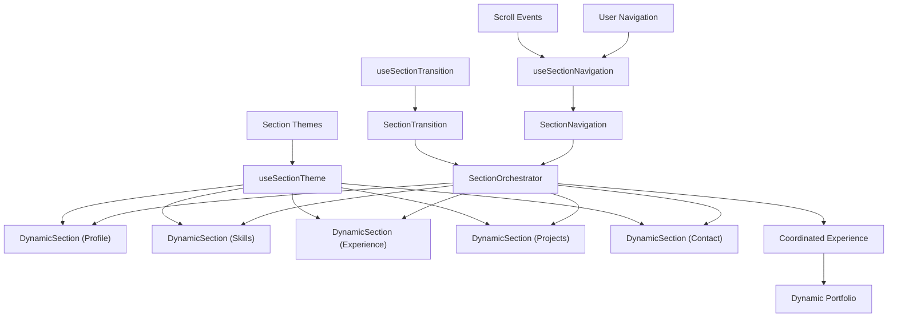

# User Story: 8 - Navigate Through Dynamic Sections

**As a** website visitor,
**I want** to navigate through dynamic, animated sections rather than conventional long pages,
**so that** I have an engaging, non-boring browsing experience with smooth transitions between content areas.

## Acceptance Criteria

* Sections transition smoothly with scroll-based animations
* Each content area has its own distinct visual treatment and animation
* Navigation between sections feels fluid and intentional
* Sections "come alive" with appropriate animations and interactions
* Content areas are clearly delineated without feeling disconnected
* Users can easily understand their current location within the portfolio
* Transitions enhance rather than hinder content consumption

## Notes

* Avoids conventional long-page layouts that can feel boring
* Creates a more engaging alternative to standard portfolio presentations
* Showcases advanced front-end animation and transition skills

## Implementation Plan

### 1. Feature Overview

This feature transforms the traditional scrolling portfolio into a dynamic, section-based experience where each content area feels like a distinct destination with its own personality and animations. Navigation between sections is smooth and intentional, creating an engaging journey through the portfolio content.

### 2. Component Analysis & Reuse Strategy

**Existing Components:**
- ScrollTrigger and story components from previous features will be enhanced for section-based navigation
- All portfolio components will be restructured as distinct sections with individual personalities
- Progressive revelation system will be adapted for section-based storytelling

**Enhancement Strategy:**
- **Transform Existing:** Convert linear content flow into distinct sections with unique characteristics
- **New Components Required:** Section containers, transition systems, section navigation, spatial organization
- **Justification:** Builds upon all previous features to create a cohesive, section-based experience

**Component Library Additions:**
- Dynamic section containers
- Section transition systems
- Spatial navigation controls
- Section personality and theming

### 3. Affected Files

- `[CREATE] src/app/_components/sections/DynamicSection.tsx`
- `[CREATE] src/app/_components/sections/DynamicSection.test.tsx`
- `[CREATE] src/app/_components/sections/DynamicSection.visual.spec.ts`
- `[CREATE] src/app/_components/sections/SectionTransition.tsx`
- `[CREATE] src/app/_components/sections/SectionTransition.test.tsx`
- `[CREATE] src/app/_components/sections/SectionTransition.visual.spec.ts`
- `[CREATE] src/app/_components/sections/SectionNavigation.tsx`
- `[CREATE] src/app/_components/sections/SectionNavigation.test.tsx`
- `[CREATE] src/app/_components/sections/SectionNavigation.visual.spec.ts`
- `[CREATE] src/app/_components/sections/SectionOrchestrator.tsx`
- `[CREATE] src/app/_components/sections/SectionOrchestrator.test.tsx`
- `[CREATE] src/app/_components/sections/SectionOrchestrator.visual.spec.ts`
- `[CREATE] src/hooks/useSectionNavigation.ts`
- `[CREATE] src/hooks/useSectionTransition.ts`
- `[CREATE] src/hooks/useSectionTheme.ts`
- `[CREATE] src/utils/sectionHelpers.ts`
- `[CREATE] src/utils/transitionHelpers.ts`
- `[MODIFY] src/app/_components/portfolio/ProfileHeader.tsx`
- `[MODIFY] src/app/_components/portfolio/SkillsSection.tsx`
- `[MODIFY] src/app/_components/portfolio/ExperienceSection.tsx`
- `[MODIFY] src/app/_components/portfolio/ProjectsSection.tsx`
- `[MODIFY] src/app/_components/portfolio/ContactSection.tsx`
- `[MODIFY] src/app/_components/story/NarrativeFlow.tsx`
- `[MODIFY] src/app/_components/interactions/ScrollTrigger.tsx`
- `[MODIFY] src/app/page.tsx`
- `[CREATE] src/styles/sections.css`

### 4. Component Breakdown

**DynamicSection Component:**
- **Location:** `src/app/_components/sections/DynamicSection.tsx`
- **Type:** Client Component (animation and theme management)
- **Responsibility:** Create distinct section experiences with unique visual personalities and animations
- **Props Interface:**
  ```typescript
  interface DynamicSectionProps {
    children: React.ReactNode;
    sectionId: string;
    theme: SectionTheme;
    personality: SectionPersonality;
    enterAnimation?: AnimationConfig;
    exitAnimation?: AnimationConfig;
    backgroundElements?: React.ReactNode;
    navigation?: SectionNavigationConfig;
    onEnter?: () => void;
    onExit?: () => void;
    className?: string;
  }

  interface SectionTheme {
    colors: ColorPalette;
    typography: TypographyConfig;
    spacing: SpacingConfig;
    effects: EffectConfig;
  }

  interface SectionPersonality {
    mood: 'professional' | 'creative' | 'technical' | 'friendly' | 'elegant';
    energy: 'calm' | 'moderate' | 'dynamic' | 'intense';
    focus: 'content' | 'visual' | 'interactive' | 'immersive';
  }
  ```

**SectionTransition Component:**
- **Location:** `src/app/_components/sections/SectionTransition.tsx`
- **Type:** Client Component (transition orchestration)
- **Responsibility:** Orchestrate smooth transitions between sections with directional awareness
- **Props Interface:**
  ```typescript
  interface SectionTransitionProps {
    fromSection: string;
    toSection: string;
    direction: 'up' | 'down' | 'left' | 'right';
    transitionType: 'fade' | 'slide' | 'morph' | 'zoom' | 'custom';
    duration?: number;
    onTransitionStart?: () => void;
    onTransitionComplete?: () => void;
    className?: string;
  }
  ```

**SectionNavigation Component:**
- **Location:** `src/app/_components/sections/SectionNavigation.tsx`
- **Type:** Client Component (navigation controls)
- **Responsibility:** Provide intuitive navigation between sections with progress indication
- **Props Interface:**
  ```typescript
  interface SectionNavigationProps {
    sections: SectionInfo[];
    currentSection: string;
    navigationStyle: 'dots' | 'minimap' | 'progress' | 'timeline' | 'adaptive';
    position: 'fixed' | 'floating' | 'inline';
    orientation: 'horizontal' | 'vertical';
    showLabels?: boolean;
    onSectionChange?: (sectionId: string) => void;
    className?: string;
  }

  interface SectionInfo {
    id: string;
    title: string;
    shortTitle?: string;
    icon?: React.ReactNode;
    progress?: number;
    locked?: boolean;
  }
  ```

**SectionOrchestrator Component:**
- **Location:** `src/app/_components/sections/SectionOrchestrator.tsx`
- **Type:** Client Component (section management)
- **Responsibility:** Coordinate section states, transitions, and overall experience flow
- **Props Interface:**
  ```typescript
  interface SectionOrchestratorProps {
    sections: PortfolioSection[];
    initialSection?: string;
    transitionMode: 'scroll' | 'click' | 'automatic' | 'hybrid';
    globalTheme?: GlobalThemeConfig;
    onSectionChange?: (section: PortfolioSection) => void;
    className?: string;
  }

  interface PortfolioSection {
    id: string;
    component: React.ComponentType;
    theme: SectionTheme;
    personality: SectionPersonality;
    transitions: TransitionConfig;
    dependencies?: string[];
  }
  ```

**useSectionNavigation Hook:**
- **Location:** `src/hooks/useSectionNavigation.ts`
- **Responsibility:** Manage section navigation state and transitions
- **Return Interface:**
  ```typescript
  interface SectionNavigation {
    currentSection: string;
    previousSection: string | null;
    nextSection: string | null;
    progress: number;
    navigateToSection: (sectionId: string) => void;
    navigateNext: () => void;
    navigatePrevious: () => void;
    isTransitioning: boolean;
  }
  ```

### 5. Design Specifications

**Section-Specific Color Themes:**

| Section | Primary Color | Secondary Color | Accent Color | Mood |
|---------|--------------|----------------|--------------|------|
| Profile/Hero | #1a1a2e | #16213e | #e94560 | Professional/Elegant |
| Skills | #16213e | #2a2a4e | #00f5ff | Technical/Dynamic |
| Experience | #1e1e3e | #2e2e5e | #ff6b9d | Professional/Confident |
| Projects | #1a2e3e | #2a3e5e | #9b59b6 | Creative/Impressive |
| Contact | #2e1a3e | #3e2a4e | #2ecc71 | Friendly/Approachable |

**Section Transition Types:**

| Transition Type | Use Case | Duration | Effect |
|----------------|----------|-----------|---------|
| Fade | Gentle topic changes | 400-600ms | Cross-fade between sections |
| Slide | Directional navigation | 500-700ms | Horizontal/vertical slide |
| Morph | Related content | 600-800ms | Shape and color morphing |
| Zoom | Focus changes | 400-500ms | Scale-based transitions |
| Custom | Unique personalities | 600-1000ms | Section-specific effects |

**Section Personality Specifications:**
- **Professional:** Clean lines, measured animations, traditional layouts
- **Creative:** Dynamic shapes, playful transitions, asymmetrical layouts
- **Technical:** Grid-based, systematic animations, monospace accents
- **Friendly:** Rounded corners, bouncy animations, warm colors
- **Elegant:** Subtle effects, sophisticated timing, premium feel

### 6. Data Flow & State Management

**Additional Types Location:** `src/types/sections.ts`

**Section Type Definitions:**
```typescript
interface SectionState {
  activeSection: string;
  transitionState: 'idle' | 'entering' | 'active' | 'exiting';
  navigationHistory: string[];
  sectionProgress: Record<string, number>;
  sectionVisitCount: Record<string, number>;
}

interface TransitionConfig {
  enter: AnimationConfig;
  exit: AnimationConfig;
  duration: number;
  easing: string;
  stagger?: number;
}

interface AnimationConfig {
  type: 'fade' | 'slide' | 'scale' | 'rotate' | 'morph' | 'custom';
  direction?: 'up' | 'down' | 'left' | 'right' | 'in' | 'out';
  distance?: number;
  scale?: number;
  opacity?: [number, number];
}

interface NavigationContext {
  currentSection: string;
  availableSections: string[];
  canNavigateForward: boolean;
  canNavigateBackward: boolean;
  transitionInProgress: boolean;
}
```

**State Management:**
- **Global Section State:** Track active section, transition states, navigation history
- **Section-Level State:** Individual section personalities, themes, and progress
- **Transition Coordination:** Manage timing and synchronization across sections
- **User Navigation:** Track user preferences and optimize section experiences

### 7. API Endpoints & Contracts

No API endpoints required. All section management is client-side with optional analytics for section engagement.

### 8. Integration Diagram



### 9. Styling

**Section-Based Design System:**
- **Theme Switching:** Smooth transitions between section-specific color palettes
- **Personality Expression:** Visual characteristics that reflect each section's purpose
- **Spatial Organization:** Clear boundaries and relationships between sections
- **Transition Continuity:** Maintaining visual cohesion during section changes

**CSS Section Architecture:**
```css
/* Dynamic section base styling */
.dynamic-section {
  min-height: 100vh;
  padding: var(--section-padding);
  position: relative;
  overflow: hidden;
  transition: all 600ms cubic-bezier(0.25, 0.46, 0.45, 0.94);
}

/* Section personality classes */
.section-professional {
  --primary-color: #1a1a2e;
  --accent-color: #e94560;
  --animation-timing: cubic-bezier(0.4, 0, 0.2, 1);
}

.section-technical {
  --primary-color: #16213e;
  --accent-color: #00f5ff;
  --animation-timing: cubic-bezier(0.25, 0.46, 0.45, 0.94);
}

.section-creative {
  --primary-color: #1a2e3e;
  --accent-color: #9b59b6;
  --animation-timing: cubic-bezier(0.68, -0.55, 0.265, 1.55);
}

/* Section transition animations */
.section-transition-slide-enter {
  transform: translateX(100%);
  opacity: 0;
}

.section-transition-slide-enter-active {
  transform: translateX(0);
  opacity: 1;
  transition: transform 500ms ease-out, opacity 500ms ease-out;
}

.section-transition-slide-exit {
  transform: translateX(0);
  opacity: 1;
}

.section-transition-slide-exit-active {
  transform: translateX(-100%);
  opacity: 0;
  transition: transform 500ms ease-out, opacity 500ms ease-out;
}

/* Section navigation styling */
.section-navigation {
  position: fixed;
  z-index: 1000;
  backdrop-filter: blur(10px);
  background: rgba(26, 26, 46, 0.9);
  border-radius: 12px;
  padding: 16px;
}

.section-nav-dot {
  width: 12px;
  height: 12px;
  border-radius: 50%;
  background: rgba(255, 255, 255, 0.3);
  transition: all 300ms ease-out;
  cursor: pointer;
}

.section-nav-dot.active {
  background: var(--accent-color);
  transform: scale(1.3);
  box-shadow: 0 0 12px rgba(233, 69, 96, 0.5);
}
```

### 10. Testing Strategy

**Section Navigation Tests:**
- `src/app/_components/sections/DynamicSection.test.tsx` - Section theming, personality application, animation states
- `src/app/_components/sections/SectionTransition.test.tsx` - Transition timing, directional awareness, smoothness
- `src/app/_components/sections/SectionNavigation.test.tsx` - Navigation controls, progress indication, accessibility
- `src/app/_components/sections/SectionOrchestrator.test.tsx` - Section coordination, state management, experience flow

**Experience Flow Tests:**
- Complete section navigation flow testing
- Transition timing and coordination verification
- Section personality and theming accuracy
- Navigation control responsiveness and accessibility
- Cross-browser section transition compatibility

**Performance Tests:**
- Section transition performance and smoothness
- Memory usage during section changes
- Animation performance across different devices
- Theme switching performance and visual continuity

### 11. Accessibility (A11y) Considerations

- **Section Navigation:** Clear section landmarks and navigation structure
- **Progress Indication:** Accessible section progress and location indicators
- **Keyboard Navigation:** Full keyboard support for section navigation
- **Screen Readers:** Proper announcements for section changes and progress
- **Motion Preferences:** Alternative navigation methods for users with motion sensitivity
- **Focus Management:** Logical focus flow when navigating between sections

### 12. Security Considerations

- **Navigation State:** Secure handling of section navigation history and preferences
- **Animation Performance:** Prevent performance-based DoS through animation overload
- **Theme Switching:** Ensure theme changes don't expose sensitive styling information
- **User Tracking:** Respect privacy in section engagement and navigation analytics

### 13. Implementation Steps

**Implementation Checklist:**

**Phase 1: UI Implementation with Mock Data**

**1. Section Architecture Foundation:**
- [ ] Create `src/styles/sections.css` with section-based styling system
- [ ] Define CSS custom properties for section themes and personalities
- [ ] Set up section transition animations and timing functions
- [ ] Create section navigation and spatial organization utilities

**2. Core Section Components:**
- [ ] Create `src/app/_components/sections/DynamicSection.tsx`
- [ ] Implement section theming and personality system
- [ ] Add section-specific animations and visual treatments
- [ ] Create `src/app/_components/sections/SectionTransition.tsx`
- [ ] Implement smooth transitions between sections with directional awareness
- [ ] Add multiple transition types (fade, slide, morph, zoom, custom)
- [ ] Create `src/app/_components/sections/SectionNavigation.tsx`
- [ ] Implement intuitive section navigation with progress indication
- [ ] Add multiple navigation styles (dots, minimap, progress, timeline)
- [ ] Create `src/app/_components/sections/SectionOrchestrator.tsx`
- [ ] Implement section coordination and experience flow management
- [ ] Add section state management and transition orchestration

**3. Section Navigation Hooks:**
- [ ] Create `src/hooks/useSectionNavigation.ts`
- [ ] Implement section navigation state and transition management
- [ ] Add keyboard and scroll-based navigation support
- [ ] Create `src/hooks/useSectionTransition.ts`
- [ ] Implement section transition coordination and timing
- [ ] Add transition performance monitoring and optimization
- [ ] Create `src/hooks/useSectionTheme.ts`
- [ ] Implement dynamic section theming and personality application
- [ ] Add theme transition smoothing and continuity

**4. Portfolio Section Transformation:**
- [ ] Transform `ProfileHeader.tsx` into dynamic hero section
- [ ] Apply professional/elegant personality with sophisticated animations
- [ ] Add section-specific background elements and interactions
- [ ] Transform `SkillsSection.tsx` into technical showcase section
- [ ] Apply technical/dynamic personality with grid-based animations
- [ ] Add skill exploration interactions and tech-inspired effects
- [ ] Transform `ExperienceSection.tsx` into career journey section
- [ ] Apply professional/confident personality with timeline animations
- [ ] Add experience storytelling with section-specific transitions
- [ ] Transform `ProjectsSection.tsx` into creative portfolio section
- [ ] Apply creative/impressive personality with dynamic project displays
- [ ] Add project showcase interactions and visual effects
- [ ] Transform `ContactSection.tsx` into friendly connection section
- [ ] Apply friendly/approachable personality with welcoming animations
- [ ] Add contact interaction encouragement and accessibility

**5. Section Integration & Orchestration:**
- [ ] Integrate all sections into SectionOrchestrator
- [ ] Set up section navigation flow and transition coordination
- [ ] Add section progress tracking and navigation history
- [ ] Implement responsive section navigation for different devices
- [ ] Configure section-specific themes and personality expressions

**6. Section Styling Implementation:**
- [ ] Verify section colors match personality specifications EXACTLY using direct hex values
- [ ] Apply section-specific animation timing and personality characteristics
- [ ] Implement smooth section transitions with proper easing and timing
- [ ] Set up section navigation styling with accessibility considerations
- [ ] Add responsive section layout for different screen sizes
- [ ] Test section personality expression and visual continuity

**7. Section Experience Testing:**
- [ ] Create comprehensive section navigation tests
- [ ] Test section transitions and timing coordination
- [ ] Verify section personality application and theming
- [ ] Test section navigation accessibility and keyboard support
- [ ] Add comprehensive section data-testid attributes
- [ ] Manual testing of complete section-based experience

**Phase 2: Advanced Section Features & Polish**

**8. Advanced Section Interactions:**
- [ ] Implement gesture-based section navigation for mobile
- [ ] Add section-specific easter eggs and interactive elements
- [ ] Create intelligent section recommendations based on user behavior
- [ ] Add section bookmarking and deep linking

**9. Section Performance Optimization:**
- [ ] Implement lazy loading for section content and animations
- [ ] Optimize section transition performance for smooth experiences
- [ ] Add intelligent section pre-loading based on navigation patterns
- [ ] Optimize memory usage during section changes

**10. Section Analytics & Personalization:**
- [ ] Implement section engagement tracking and analytics
- [ ] Add user preference learning for optimal section experiences
- [ ] Create adaptive section personalities based on user interactions
- [ ] Add section completion tracking and achievement systems

**11. Cross-Device Section Experience:**
- [ ] Test section navigation across desktop, tablet, and mobile
- [ ] Verify section transitions work smoothly on all devices
- [ ] Test section personality expression across different screen sizes
- [ ] Ensure section accessibility across all device types

### Playwright E2E & Visual Testing (for Dynamic Section Navigation)

**Visual Testing Strategy:**
- **Section Transition Testing:** Verify smooth transitions between all sections with correct timing
- **Personality Expression:** Test section-specific theming and visual personality application
- **Navigation Control Testing:** Verify section navigation controls work correctly across devices
- **Progress Indication:** Test section progress indicators and navigation state management
- **Complete Experience Flow:** Test entire section-based portfolio experience across Mobile (375x667px), Tablet (768x1024px), Desktop (1280x800px), Large (1920x1080px)

**Required Test Files:**
- `src/app/_components/sections/DynamicSection.visual.spec.ts`
- `src/app/_components/sections/SectionTransition.visual.spec.ts`
- `src/app/_components/sections/SectionNavigation.visual.spec.ts`
- `src/app/_components/sections/SectionOrchestrator.visual.spec.ts`

**Section Experience Test Requirements:**
- Test navigation between all sections with various transition types
- Verify section personality and theming accuracy across all sections
- Test section navigation accessibility with keyboard and screen readers
- Validate smooth transition timing and animation performance
- Test section progress tracking and navigation state management

**Performance Test Requirements:**
- Monitor section transition performance and smoothness
- Test memory usage during section navigation sessions
- Verify animation performance during section changes
- Validate section loading performance and optimization

### References

- Section-based design: Single-page application patterns, section navigation best practices
- Transition design: Animation principles, motion design, spatial navigation
- User experience flow: Navigation patterns, progress indication, user journey optimization
- Web animation performance: GPU acceleration, smooth transitions, animation optimization
